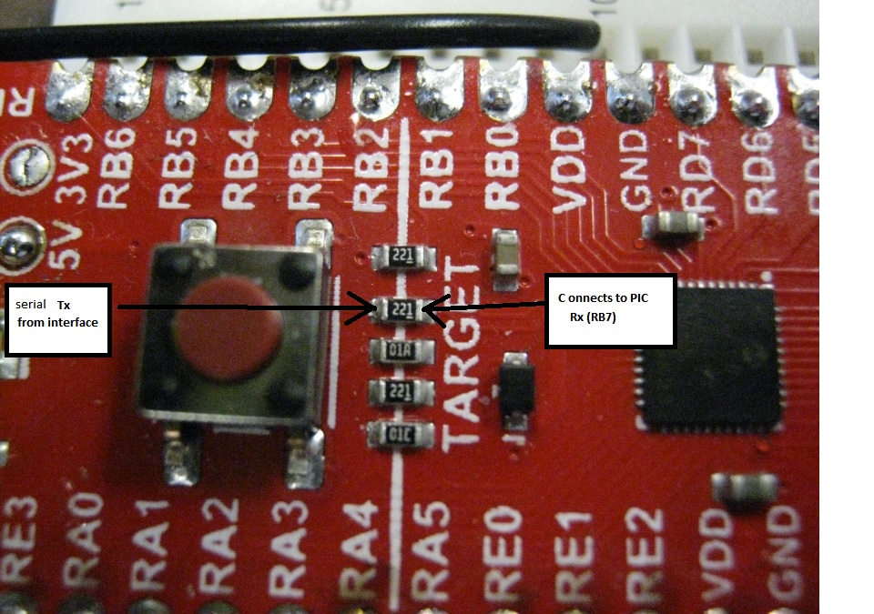

# Testing PIC18F46K42 XPRESS Board

Initial testing of Microchip XPRESS board with the PIC18F46K42 target MCU.

The example Microchip Code Configurator was used to generate most of the code in the initial commit of this project.
It was my first attempt at using the Code Configurator tool. Example code for main was found in UART.h.

All this first example does is echo back code received on the USART Rx line. In this case no interrupts have been used.

## Testing Branch

In this branch looked at timing in main while loop.

* channel 1 is test2_PORT
* channel 2 is test1_PORT

Used channel 1 as normal trigger source. Channel 1 stays high when character received on UART2 until it is ready for another character.

### Pins Used

!(){images/pins.png} 

## Board Features

This board has a USB microB connector. It has a PIC MCU on board configured to act as an interface and it enumarates as 
a mutifunction device. This allows one to both download programs to it and use the interface as a virtual com port. The board
is also less expensive than the USB to serial board we have used in the past with the Microstick II or PIC18F4525.

## Tags

* echo 
    * Anything received on the boards USB was echoed back
* echo.and.printf
    * As above but adds initial message using printf() 
	* the printf is dicrected to UART2 which is connected to the USB
* echo.copy.uart1
    * as above but everything echoed back to USB is also echoed to UART1 TX
	* This is a very simple change. Just starting to explore the use of two UARTs
* echo.copy.uart1.newline
    * as above but newline character added to carage returns
	* new section below on PuTTY issues (limitations on USB to serial bridge of Xpress board)

## More info on the DM182026

* [https://www.microchip.com/DevelopmentTools/ProductDetails/DM182026](https://www.microchip.com/DevelopmentTools/ProductDetails/DM182026)

The documents on that site are helpful but what I did not find was simple examples specifically for this board before going
ahead and trying out the code configuator. The default program in the PIC18F46K42 appeared to set most the pins as GPIO and 
send a pulse to them periodically. The USART in the target MCU was not interacting at all with the MCU on the board providing 
the USB to serial functions. 

### Probing the DM182026 for Serial Signal

**This section is now historical only.**

* The serial signal from the USB multifunction MCU was verified as transmitting a serial signal by 
  testing with PuTTY on a computer and probing with a Digital Storage Oscilloscope.
* It was verified that the other side of a buffer resistor was connected to RB7 using an Ohm meter (the board was disconnected 
  from the USB for this test).
  

* The serial signal from PuTTY would be seen on RB7 of the target PIC if the pin were configured as an input. One would most 
  certainly want to configure RB6 as the PIC TX pin and RB7 as the PIC RX pin.
  
## Code Configurator settings

The code in this project was primarily generated by the Code Configurator. The settings used may not be optimal at all. 
The initial goal was just to get the UART of the target PIC to talk to the UART of the interface PIC.

## Working with PuTTY and issues

One can use a PuTTY terminal with the virtual serial port of the Xpress board. This works fine when one is typing into the 
terminal. There is an issue though if one trys pasting into the PuTTY terminal (using a right mouse click). In that case
only the first character is sent. This is an issue of the USB to serial bridge on the Xpress board and not the PIC code!
This was varified by using a USB to serial bridge on a different board (TTLyFTDI USB-to-TTL Cable Adapter) fed into RB7. In this case the code worked as expected
and all pasted characters appeared in the PuTTY terminal and were correctly sent out uart1 TX.

Others have commented on the limitation of the USART to USB bridge on the Xpress board:

* [Xpress PIC18F46K42 board virtual COM port bridge to UART receive limitations](https://www.microchip.com/forums/m1097510.aspx)
