  - [Expansion of Pololu 3Pi Robot with Xpress
    board](#expansion-of-pololu-3pi-robot-with-xpress-board)
      - [Xpress Board Features](#xpress-board-features)
          - [Pins Used](#pins-used)
      - [Pololu 3Pi robot](#pololu-3pi-robot)
          - [The 3pi Menu Data Dump
            Branch](#the-3pi-menu-data-dump-branch)
          - [The 3pi Menu Basic3 Branch](#the-3pi-menu-basic3-branch)
          - [Displaying Sensor Readings](#displaying-sensor-readings)
      - [Mounting PIC XPRESS board on 3Pi Expansion
        board](#mounting-pic-xpress-board-on-3pi-expansion-board)
          - [Mount 1 (historical)](#mount-1-historical)
          - [Mount 2](#mount-2)
      - [Roam and No Roam Slide Switch](#roam-and-no-roam-slide-switch)
      - [Autocalibrates when in Roam
        mode](#autocalibrates-when-in-roam-mode)
      - [Read Sensors](#read-sensors)
      - [Proportional Derivative Control in Roam
        mode](#proportional-derivative-control-in-roam-mode)
      - [Pull up on RX2/RB7](#pull-up-on-rx2rb7)
      - [Charging Circuit](#charging-circuit)
      - [Added Print Sensor Values to
        menu](#added-print-sensor-values-to-menu)
      - [Code Configurator settings](#code-configurator-settings)
      - [Working with PuTTY and issues](#working-with-putty-and-issues)
      - [Test of Expansion Board](#test-of-expansion-board)

<!---
use 
skip  pandoc -s --toc -t html5 -c pandocbd.css README.pandoc.md -o index.html
pandoc -s --toc -t gfm README.pandoc.md -o README.md
-->

# Expansion of Pololu 3Pi Robot with Xpress board

## Xpress Board Features

This board has a USB microB connector. It has a PIC MCU on board
configured to act as an interface and it enumerates as a multifunction
device. This allows one to both download programs to it and use the
interface as a virtual com port. The board is also less expensive than
the USB to serial board we have used in the past with the Microstick II
or PIC18F4525.

### Pins Used

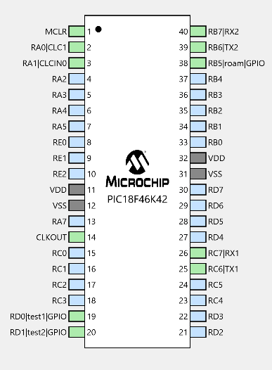

  - UART1 is at 115200 baud. Tx1 is on RC6.
  - UART2 is connected to the XPRESS boards USB interface PIC.
      - Communication between UART2 and the interface IC is at 9600
        baud.
  - roam input used to determine if robot should
    1.  Stay in place (perhaps for programming)
    2.  Roam (perhaps following a line)
  - PWM output at about 1 KHz on pad RC4 (set to 10% duty cycle)

## Pololu 3Pi robot

The robot is running the serial slave program from Pololu. This will
allow the 3Pi robot to be controlled from a XPRESS board.

  - [10.a. Serial slave
    program](https://www.pololu.com/docs/0J21/all#10.a)

More information on the Pololu 3Pi robot

  - <https://www.pololu.com/product/975>

### The 3pi Menu Data Dump Branch

3pi-menu-data-dump branch was derived from the 3pi-menu-basic3 branch.
The most significant difference is that sensor readings are stored for
future dump while running in the **Roam mode**.

  - uses three arrays to store sensor data
      - stores data from sensor 1, sensor 3 and sensor 4.
      - each array can store 1000 values
      - storage starts after calibration is completed.
      - the robot stops once 1000 samples are taken.
          - one must switch to No Roam mode to dump the data

#### Plot of sample data

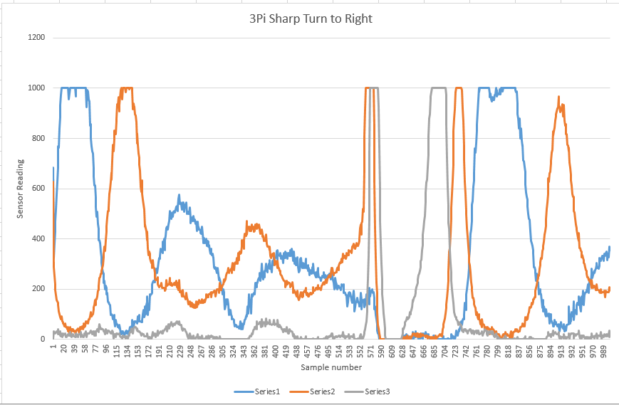

The sensors on the robot are numbered zero to four from left to right.
In this plot series 1 is sensor1, series 2 is sensor 3 and series 3 is
sensor 4.

Data collection started as the robot was returning to centre from doing
initial calibration (sensor normalization).

  - With normalization the sensor readings go to 1000 when a given
    sensor is centred over a line.
  - The robot is centred over the line when sensor 1 and sensor 3 give
    the same reading.
  - One can see a little overshoot and hunting for centring the robot up
    to around sample 540. I had the differential term set to near zero
    (constant d was arbitrarily large) so it is reasonable to assume the
    hunting could be easily reduced.
  - Sensor 4 jumps up to 1000 as it is crossing the line at the sharp
    right turn. Sensor 3 reaches the line a few samples sooner because
    on the 3Pi the sensors are mounted on the curve of the front edge of
    the robot.
  - One can see all the sensors are past the line and reading zero
    around sample 609.
  - The robot spins to the right so now sensor 4 sees the line first.
    Sensor 3 sees the line second and the robot reverses direction when
    sensor 1 is over the line.
  - There is again some hunting for the line.

#### Plot of sample data with Differential Term

A new run was made but this time the differential term was changed to
3/2 (rather than being small with d term arbitrarily large). There was
significant improvment in that robot stayed centred on the line much
better (much less hunting.

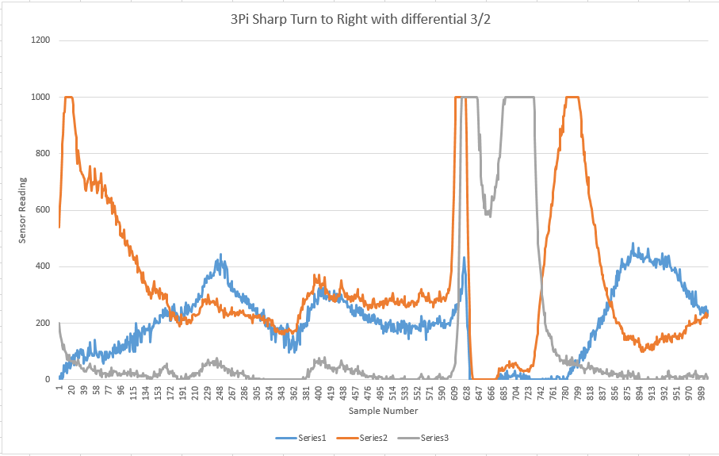

The improvement is far more evident in the plot than when simply
watching the robot as things happen fast when the robot is moving.

### The 3pi Menu Basic3 Branch

#### Roam Mode

In roam mode the robot will

1.  do a self calibration of the sensors and then follow a line for
    approximately 10 seconds.
2.  If the robot detects a line on both the far left and far right at
    the same time it will stop until power is cycled off and on. Picking
    the robot up will have the same effect of stopping the robot motors.
3.  One can switch the robot to No Roam mode after the sensor
    calibration.

#### No Roam Mode

The purpose of no Roam Mode is to

1.  Allow the robot to be programmed
2.  Allow the robot batteries to be charged
3.  Allow the robot to be in an interactive mode in which a USB cable
    and PuTTY can be used to control the robot and check sensor
    readings.

The menu mentioned in list item 3. looks as follows:

### Displaying Sensor Readings

One can in sequence use

1.  Roam mode to calibrate the sensors
2.  Pick up the robot and switch to No Roam mode (leaving the robot
    turned on)
3.  Plug in the USB cable
4.  Use Ctrl+s to continously read sensor values

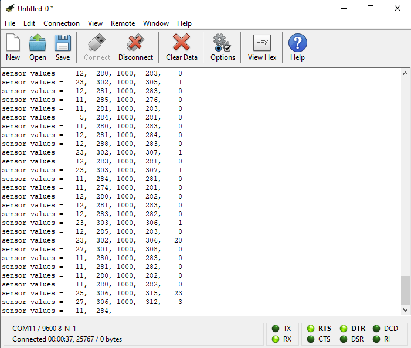

That is Coolterminal. In PuTTY the reading overwrite a single line.

A video about displaying sensor readings:

## Mounting PIC XPRESS board on 3Pi Expansion board

### Mount 1 (historical)

The first XPRESS board mount was forward on the 3Pi expansion board.
This appeared to have a negative effect on the balance and stability of
the robot. For a second mount position was tested.

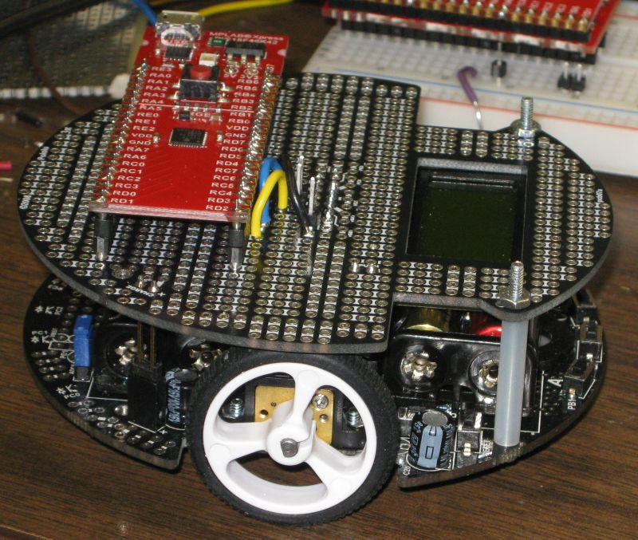

### Mount 2

For better stability the XPRESS board was moved over the wheels.

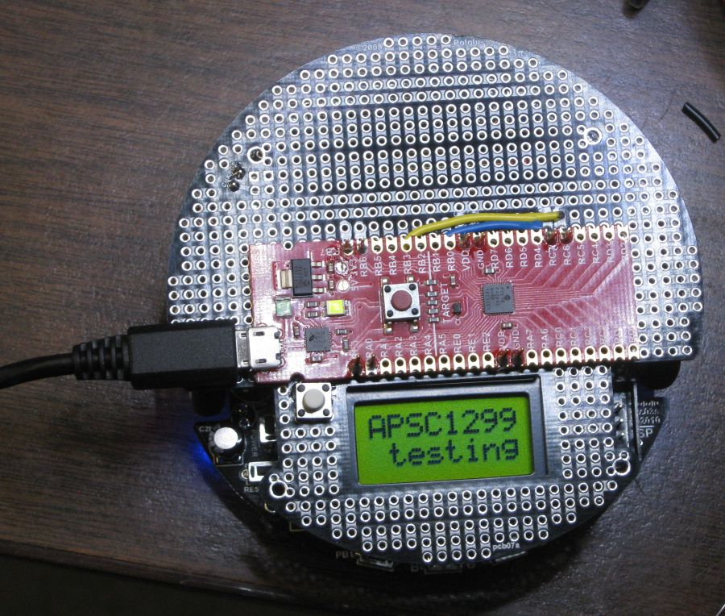

Wiring under the XPRESS board.

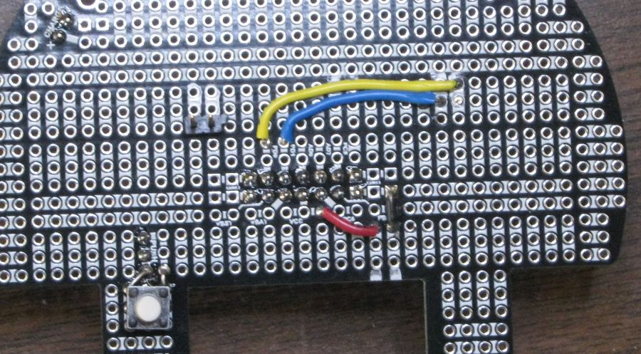

## Roam and No Roam Slide Switch

The image below shows the slide switch in the no roam possition.

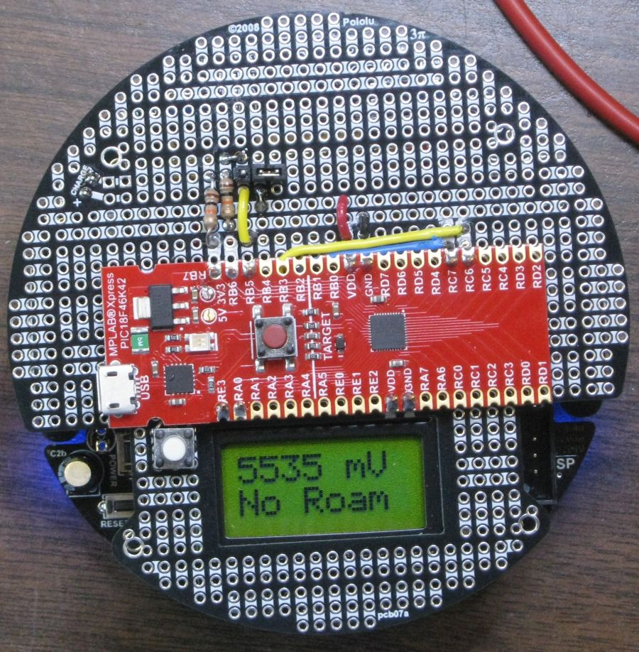

## Autocalibrates when in Roam mode

Will autocalibrate the sensors if in Roam mode. For meaningful results
the robot should be sitting over a black tape line. The robot will spin
to the left and right sweeping the sensors over the line so that
normalized readings can be calculated.

## Read Sensors

Code was added to read the sensors while the **slave** is executing
proportional derivative control.

  - see **Proportional Derivative Control in Roam mode** section down
    below.

Unlike the **test-read-sensors** branch the sensor values are not sent
to PuTTY.

Currently in the main branch far left and far right sensor are checked
to see if they are greater than 500. If either are greater than 500 it
is assumed a line was seen on the far left or far right and this causes
the robot to exit proportional derivative control. It just stops and
does nothing in that case.

Note that this is simply a test to ensure that the slave can
successfully both run proportional derivative control and report sensor
readings back to the PIC on the Xpress board.

In this branch the test2\_PORT signals are ignored\! The following was
used only in the **test-read-sensors** branch:

**test2\_PORT** was used to provide timing to a DSO so that the time
required to read all 5 sensors and load that data into the PIC18F46K42
could be measured. The time was **2.46 mS**.

The test points are shown in this image:

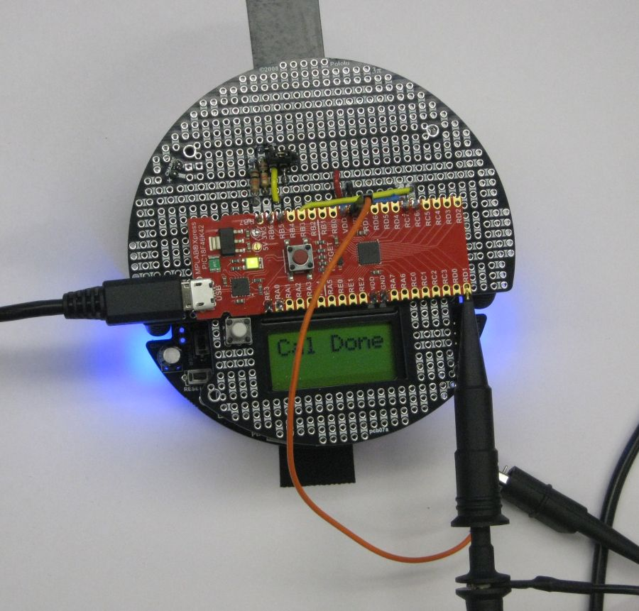

The timing signal from test2\_PORT on the Digital Storage Oscilloscope:

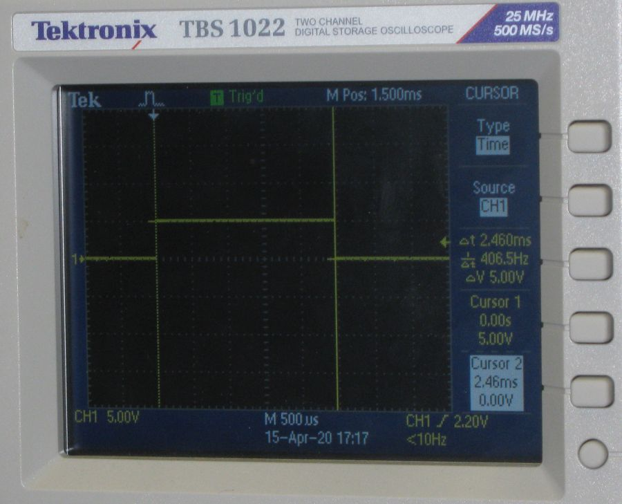

## Proportional Derivative Control in Roam mode

Another function has been added to allow the MCU on the main board of
the 3Pi robot to run proportional derivative code when the robot is in
Roam mode. The robot follows sharp turns and curves but knows nothing of
gaps and other APSC1299 special obstacles. This could possibly work fine
for demos.

## Pull up on RX2/RB7

A 10 Kohm pull up resistor was added to RX2 for better reliability when
USB cable is not attached.

## Charging Circuit

A charging circuit has been added to the expantion board. The charging
circuit is just a 75 ohm resistor in series with the four AAA NiMH cells
on the robot. A 9 volt external AC-DC adaptor provides power to the
board.

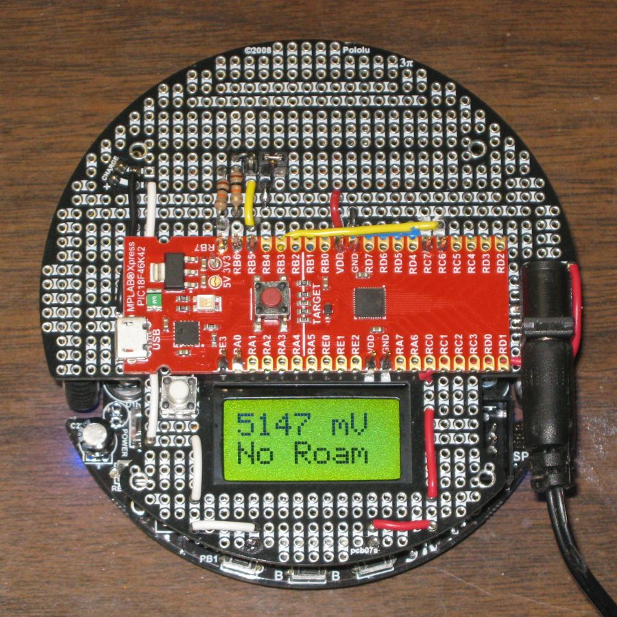

Showing the 75 ohm 2 watt resistor (located under the expansion board.

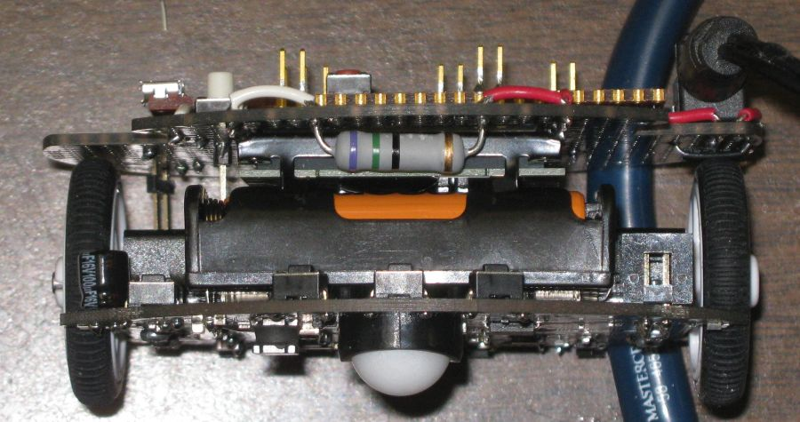

**Will update photos. Had to move one jumper to top side of board as it
caused rubbing on right wheel. Also bend tab on barrel connector so it
is flush on board before soldering.**

## Added Print Sensor Values to menu

Can now print sensor values in PuTTY when in No Roam mode. Can move
robot over track by hand.

## Code Configurator settings

The code in this project was primarily generated by the Code
Configurator. The settings used may not be optimal at all. The initial
goal was just to get the UART of the target PIC to talk to the UART of
the interface PIC.

## Working with PuTTY and issues

One can use a PuTTY terminal with the virtual serial port of the Xpress
board. This works fine when one is typing into the terminal. There is an
issue though if one attempts pasting into the PuTTY terminal (using a
right mouse click). In that case only the first character is sent. This
is an issue of the USB to serial bridge on the Xpress board and not the
PIC code\!

Others have commented on the limitation of the USART to USB bridge on
the Xpress board:

  - [Xpress PIC18F46K42 board virtual COM port bridge to UART receive
    limitations](https://www.microchip.com/forums/m1097510.aspx)

## Test of Expansion Board

Initial testing of expansion board for 3PI.

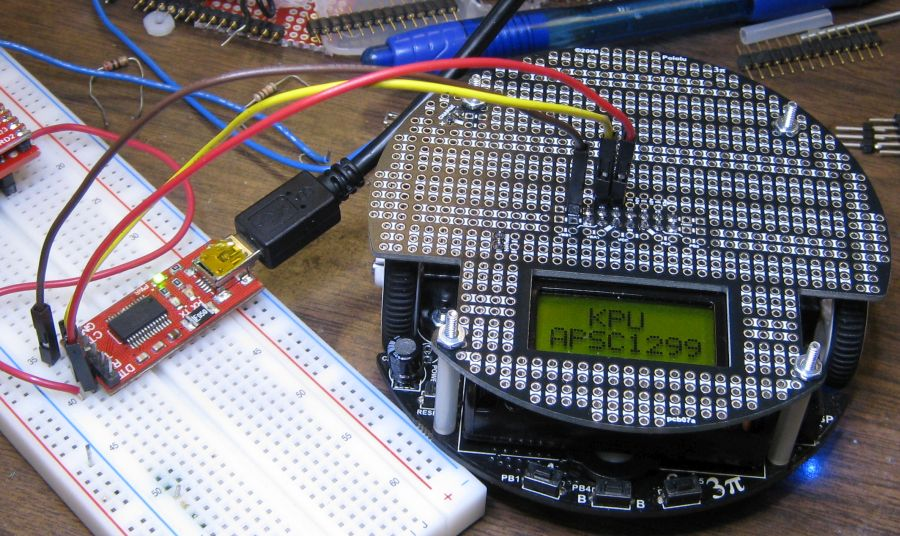
