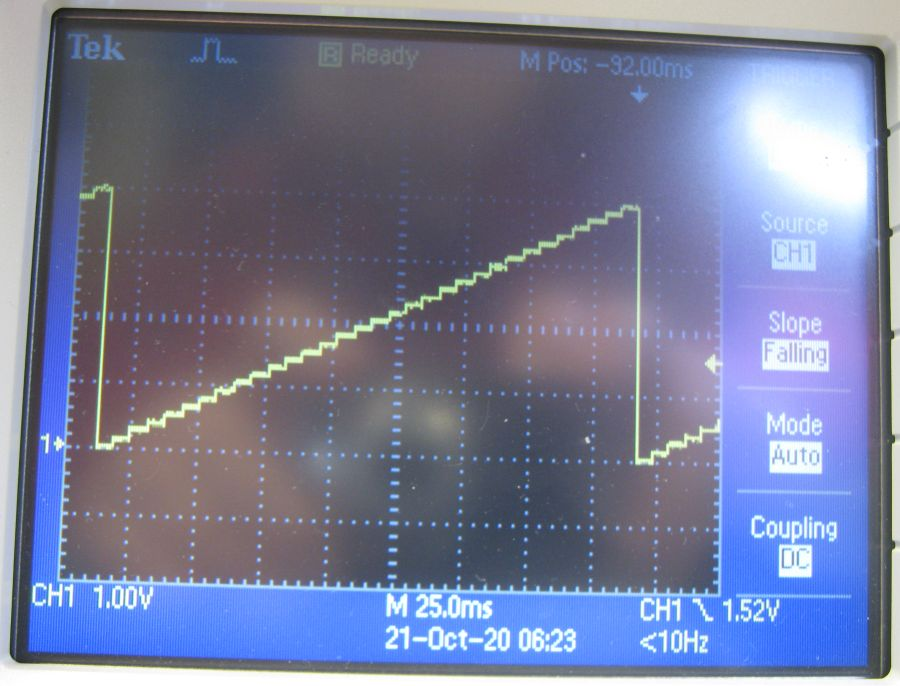
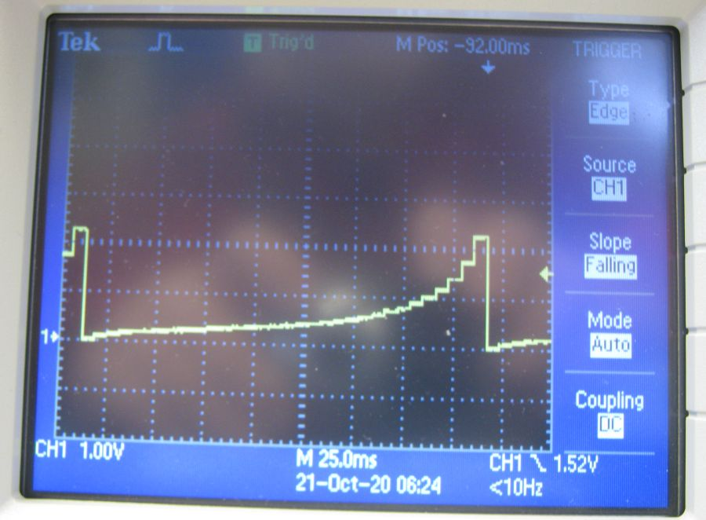
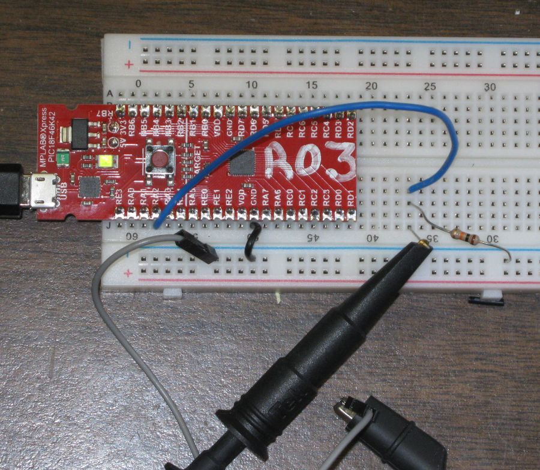
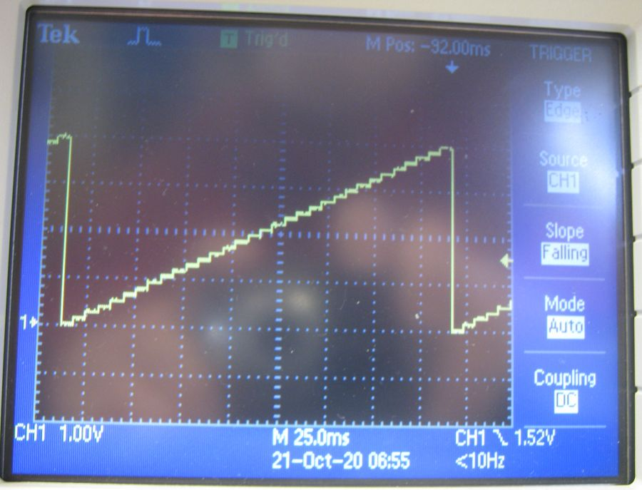
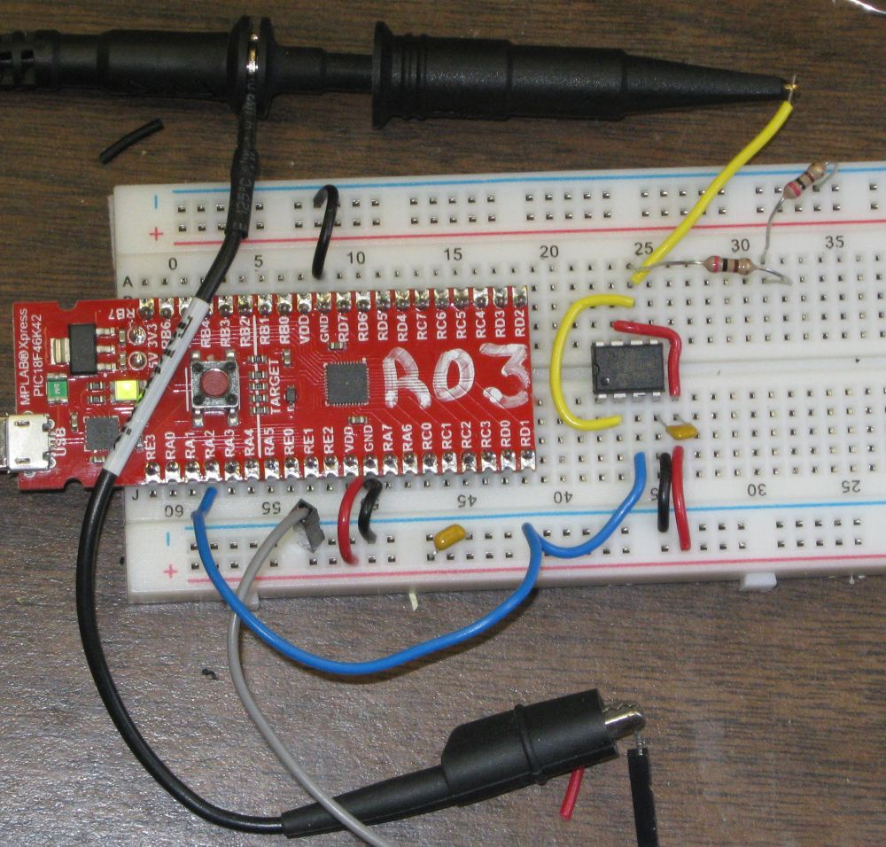
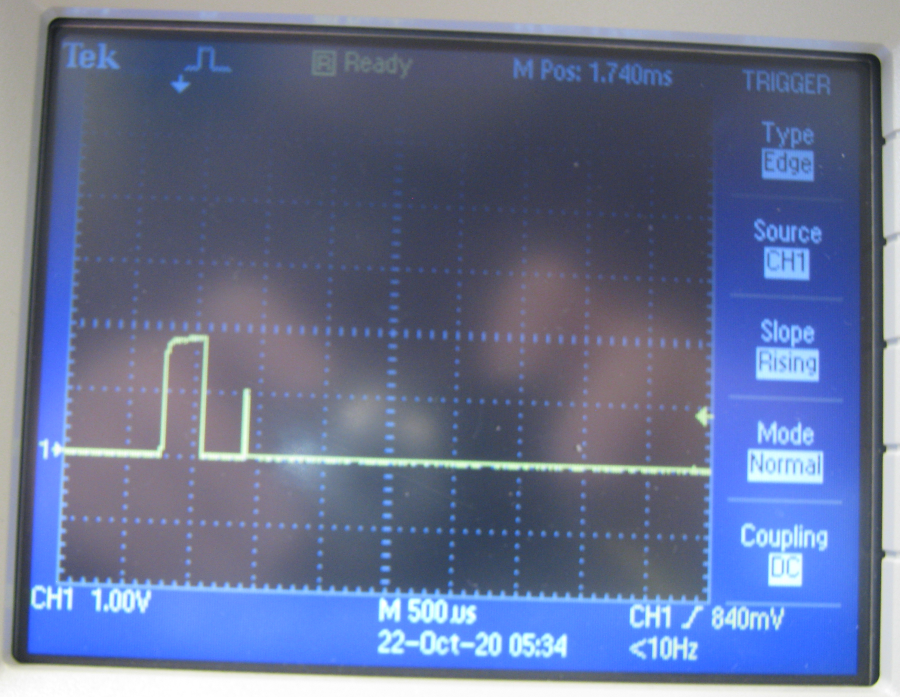
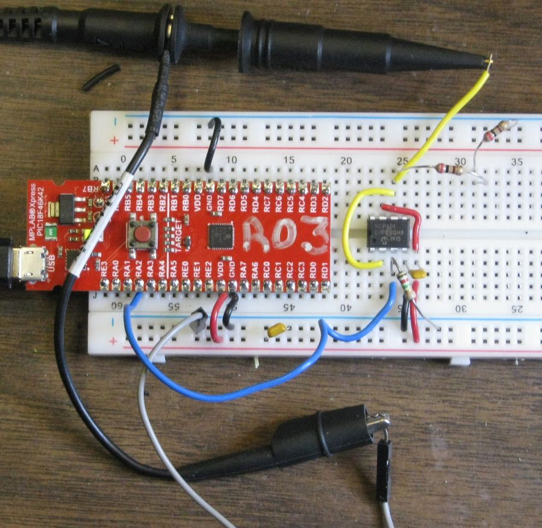

  - [Testing PIC18F46K42 XPRESS Board
    DAC](#testing-pic18f46k42-xpress-board-dac)
      - [Used Fixed Voltage Reference](#used-fixed-voltage-reference)
      - [Without a Buffer IC](#without-a-buffer-ic)
          - [No Load](#no-load)
          - [10 K Load](#k-load)
      - [With IC Buffer and 400 ohm
        Load](#with-ic-buffer-and-400-ohm-load)
      - [Avoiding Power-on Glitch](#avoiding-power-on-glitch)
      - [Pins Used](#pins-used)

<!---
use 
pandoc -s --toc -t html5 -c pandocbd.css README.pandoc.md -o index.html

pandoc -s --toc -t gfm README.pandoc.md -o README.md
-->

# Testing PIC18F46K42 XPRESS Board DAC

This branch of the project was set up to look at the output of the DAC.
The PIC18F46K42 has just one internal 5 bit DAC. It is possible to
assign the DAC output to RA2 and/or RB7. When using the Xpress board it
is only practical to use RA2 as the DAC output pin because RB7 is
hardwired to the output of another IC on the board through a 220 Ω
resistor.


## Used Fixed Voltage Reference

The internal fixed voltage reference was used with gain set to 4. This
results in a reference voltage of four volts. With is the DAC output
ranges from 0 to four volts.

## Without a Buffer IC

There is no built in buffer for the DAC in the PIC18F46K42. Even a 10 kΩ
load resistor has a drastic effect on the output voltage. This means it
is necessary to use an external buffer for the DAC.

### No Load



### 10 K Load





## With IC Buffer and 400 ohm Load





## Avoiding Power-on Glitch

Power-on can result in transients. The PIC pins had a default to be
inputs at power-up. Code must be run to initialize the IO pins and
peripherals. Since pin 4 of the PIC is an input initially, pin 3 of the
op-amp is left floating initially. This results in a significant glitch
at the output of the op-amp if pin 3 is left open.



To avoid having pin 3 of the op-amp float at power up a load resistor
can be placed between pin3 and ground. The value of the reasistor must
be large enough to avoid loading the DAC1 output once it is initialized.
A 1.2 MΩ resistor works for this.



The power on transient at the output of the op amp now looks like this.


The code was also changed to set the DAC output to decimal 26 imediately
ofter the peripherals were initialized.

``` c
void main(void)
{
    // Initialize the device
    SYSTEM_Initialize();
    DAC1_SetOutput(26);
    ...
```

## Pins Used


  - DAC1OUT1 is on pin 4 (RC2)
  - UART1 is at 115200 baud. Tx1 is on RC6.
  - UART2 is connected to the XPRESS boards USB interface PIC.
      - Communication between UART2 and the interface IC is at 9600
        baud.
