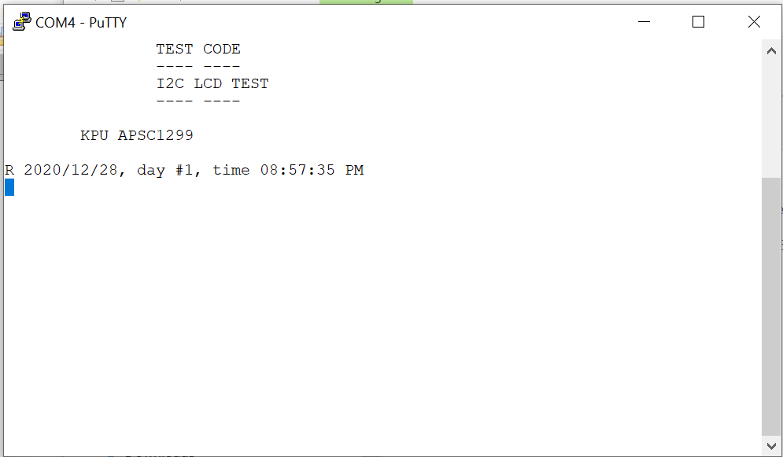
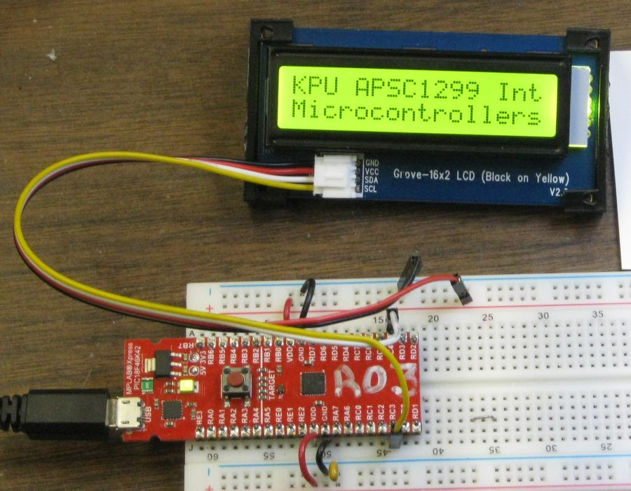
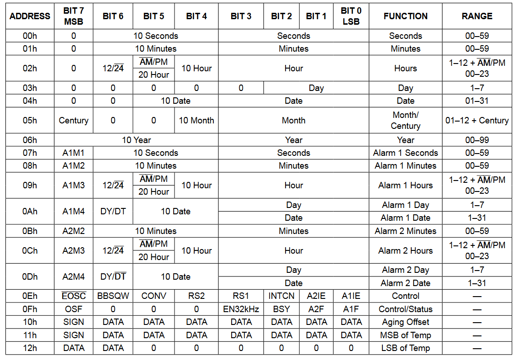
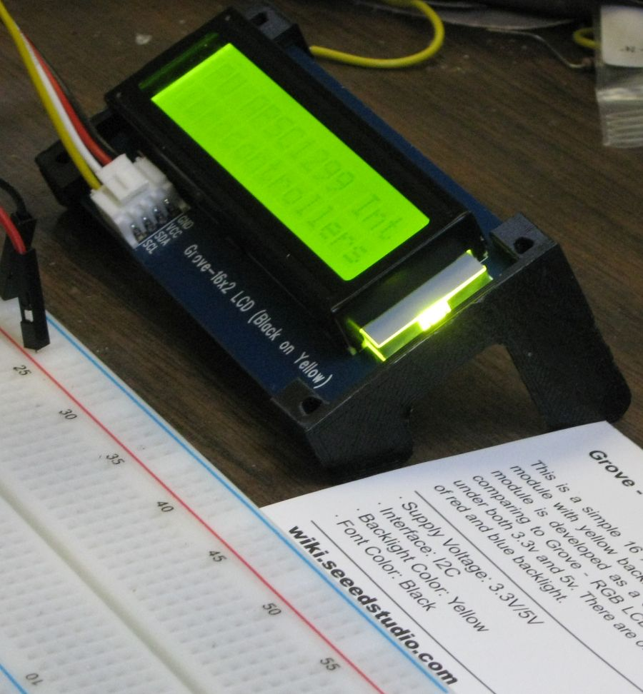
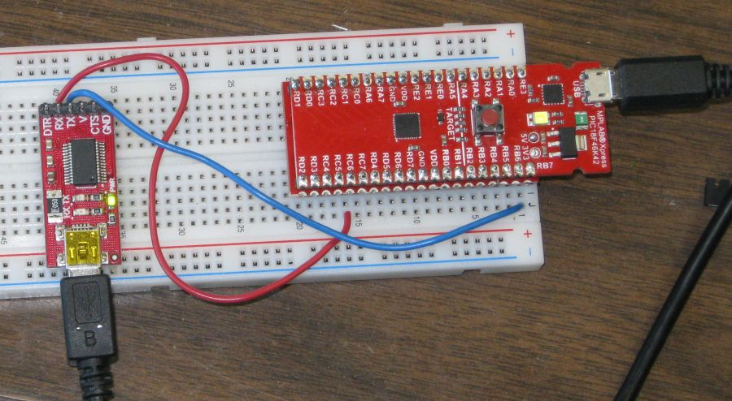
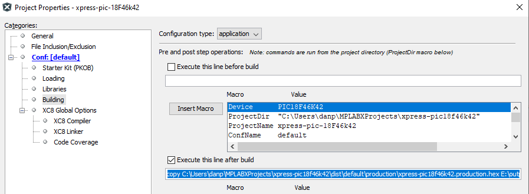

-   [Testing PIC18F46K42 XPRESS
    Board](#testing-pic18f46k42-xpress-board)
    -   [This Branch of Project](#this-branch-of-project)
        -   [Typing Ctrl and some other character in
            PuTTY](#typing-ctrl-and-some-other-character-in-putty)
    -   [DS3231 Real Time Clock (RTC) Breakout
        Board](#ds3231-real-time-clock-rtc-breakout-board)
        -   [I2C Address of RTC](#i2c-address-of-rtc)
        -   [Registers in DS3231](#registers-in-ds3231)
    -   [LCD notes](#lcd-notes)
        -   [Initialization Sequence](#initialization-sequence)
        -   [Sending Characters to the
            Display](#sending-characters-to-the-display)
    -   [Xpress Board Pins Used](#xpress-board-pins-used)
    -   [3D Printed Support for the
        Display](#d-printed-support-for-the-display)
    -   [Working with PuTTY and
        limitations](#working-with-putty-and-limitations)
    -   [After Build Copy](#after-build-copy)

<!---
use 
pandoc -s --toc -t html5 -c pandocbd.css README.pandoc.md -o index.html

pandoc -s --toc -t gfm README.pandoc.md -o README.md
-->

Testing PIC18F46K42 XPRESS Board
================================

This Branch of Project
----------------------

The program send a timestamp after the initial header on startup. The
program will also will send a time stamp to the PuTTY terminal any time
a **ctrl**+‘**t**’ is typed.

This branch echos characters typed in the PuTTY terminal in addition to
sending printable characters to the LCD.

-   A ‘\\r’ causes the LCD to switch lines and return to col 0.
-   A ‘\\t’ clears the LCD.
-   A Ctrl + t causes the time to be displayed in the LCD and both time
    and date to be displayed in PuTTY.
-   A Ctrl + d causes the date to be displayed in the LCD and both time
    and date to be displayed in PuTTY.
-   A Ctrl + g will cause a bell tone in the terminal but be ignored by
    the LCD.

### Typing Ctrl and some other character in PuTTY

In the PuTTY terminal program the Ctrl key modifies character keys by
applying a mask. The result is similar to what is described at
<https://www.vocabulary.com/articles/wc/ctrlshiftreturn-keys-to-your-computer/>

quote

> …if the operator held down the Ctrl key while typing a character, the
> Teletype machine in effect subtracted 64 from the value of that
> letter. Glance again at the chart from earlier. Let’s say that the
> operator wanted a horizontal tab (9). The operator could press Ctrl
> and I (73) at the same time. To create a page break/form feed (12),
> the operator pressed Ctrl+L. To embed a character to ring the bell,
> the operator used Ctrl+G.

In PuTTY it would be more acurate to say a mask is applied as follows:

    0x1F & key

since **ctrl + t** has the same result as **ctrl + T**. They both result
in the non-printable **DC4** (same as 0x14). Note that the **t** is
**0x74** and **T** is **0x54**.

An **ASCCII** table can be found at <http://www.asciitable.com/>

DS3231 Real Time Clock (RTC) Breakout Board
-------------------------------------------

DS3231 Real Time Clock (RTC) Breakout Board from Adafruit

-   [from
    digikey](https://www.digikey.ca/en/products/detail/adafruit-industries-llc/3013/5875808)
-   [board information fro
    Adafruit](https://cdn-learn.adafruit.com/downloads/pdf/adafruit-ds3231-precision-rtc-breakout.pdf)
-   [datasheet for
    IC](https://datasheets.maximintegrated.com/en/ds/DS3231.pdf)

### I2C Address of RTC

-   I2C Address 0x68 is hardwired

### Registers in DS3231

LCD notes
---------

-   I2C Address 0X3E from [Grove - 16x2 LCD
    Specification](https://wiki.seeedstudio.com/Grove-16x2_LCD_Series/#specification)
-   [Grove Datasheet with initialization
    sequence](https://raw.githubusercontent.com/SeeedDocument/Grove-16x2_LCD_Series/master/res/JDH_1804_Datasheet.pdf)

### Initialization Sequence

This is essentially taken from [Grove Datasheet with initialization
sequence](https://raw.githubusercontent.com/SeeedDocument/Grove-16x2_LCD_Series/master/res/JDH_1804_Datasheet.pdf)

Some things were not clear from the Seeed document. For example I found
that to send commands to display I it was necessary to send a 0x80
before the command byte. This was discovered by looking at
**rgb\_lcd.cpp** which is the grove lcd library that was written for
Arduino. I also found that before sending a series of characters to be
displayed it was necessary to send a 0x40. That was also gleaned from
**rgb\_lcd.cpp**.

-   Power On
-   *Wait for more than 15 ms after VDD rises to 4.5V*
-   “Function Set” 001X NFXX
    -   where X is don’t care
    -   N is 0 1-line mode
    -   *N is 1 2-line mode*  
    -   *F is 0 5x8 dots*  
    -   F is 1 5x11 dots
-   *Wait for more than 39 µs*
-   “Display ON/OFF Control” 0000 1DCB
    -   where D 0 is display off
    -   *D 1 is display on*
    -   C 0 is Cursor off
    -   *C 1 is Cursor On*
    -   *B 0 is blink off*
    -   B 1 is blink on
-   *Wait for more than 39 µs*
-   “Display Clear” 0000 0001
-   *Wait for more than 1.53 ms*
-   “Entry Mode Set” 0000 0010

<!-- -->

    // Initialization Sequence
    __delay_ms(16); 
    I2C1_Write1ByteRegister(lcd_address, 0x80, 0x28);
    __delay_us(41);
    I2C1_Write1ByteRegister(lcd_address, 0x80, 0x0E);
    __delay_us(41);
    I2C1_Write1ByteRegister(lcd_address, 0x80, 0x01);
    __delay_ms(2); 
    I2C1_Write1ByteRegister(lcd_address, 0x80, 0x02);
    __delay_us(41);

### Sending Characters to the Display

Some things were not clear from the Seeed document. Some of these were
also mentioned in the previous section.

-   To send commands to display it is necessary to send a **0x80**
    before the command byte. This was discovered by looking at
    **rgb\_lcd.cpp** which is the grove LCD library that was written for
    Arduino.
-   Before sending a series of characters to be displayed it was
    necessary to send a **0x40**. That was also gleaned from
    **rgb\_lcd.cpp**.
-   To set the display to row 0 , col 0 a **0x80** command was sent
-   To set the display to row 1 , col 0 a **0xC0** command was sent

<!-- -->

    // send messages
    I2C1_Write1ByteRegister(lcd_address, 0x80, 0x80); // set to row 0 col 0
    __delay_us(41);
    I2C1_WriteNBytes(lcd_address, data, 17 ); // array data contains first 
                                              // string
                                              // 
    I2C1_Write1ByteRegister(lcd_address, 0x80, 0xC0); // set to row 1 col 0
    __delay_us(41);

    I2C1_WriteNBytes(lcd_address, name_msg, 17); // array name_msg contains
                                                 // second string

In addition I should point out how **data** and **name\_msg** were
defined.

    static uint8_t data[] =     "@KPU APSC1299 Int";
    static uint8_t name_msg[] = "@Microcontrollers";
    //uint8_t *msg_pnt = data;

**data** and **name\_msg** were set up as arrays initialized with
strings. The first character of the string is a ‘@’ (which is a 0x40; to
indicate the bytes coming are data and not commands). Notice on an ASCII
tables that an ascii “@” is coded as hex **0x40**.

It appears that the 0x40 to send data and 0x80 to send command are
equivalent to register values on simpler devices. The LCD documentation
is not clear. It may be more correct that in the case of the LCD they
are simply codes interpreted by the LCD module MCU.

Xpress Board Pins Used
----------------------

-   UART2 is connected to the XPRESS boards USB interface PIC.
    -   Communication between UART2 and the interface IC is at 9600
        baud.

3D Printed Support for the Display
----------------------------------

A part was 3D printed to hold the display off the table. This should
help ensure nothing is shorted on the back and also tilts the display at
a convenient viewing angle.

Working with PuTTY and limitations
----------------------------------

One can use a PuTTY terminal with the virtual serial port of the Xpress
board. This works fine when one is typing into the terminal. There is an
issue though if one attempts pasting into the PuTTY terminal (using a
right mouse click). In that case only the first character is sent. This
is an issue of the USB to serial bridge on the Xpress board and not the
PIC code! This was verified by using a USB to serial bridge on a
different board (TTLyFTDI USB-to-TTL Cable Adapter) fed into RB7. In
this case the code worked as expected and all pasted characters appeared
in the PuTTY terminal and were correctly sent out uart1 TX.

Others have commented on the limitation of the USART to USB bridge on
the Xpress board:

-   [Xpress PIC18F46K42 board virtual COM port bridge to UART receive
    limitations](https://www.microchip.com/forums/m1097510.aspx)

After Build Copy
----------------

Added after build execute option.

    copy C:\Users\danp\MPLABXProjects\xpress-pic18f46k42\dist\default\production\xpress-pic18f46k42.production.hex E:\output.hex /y

-   the output path will depend on the computer and operating system

