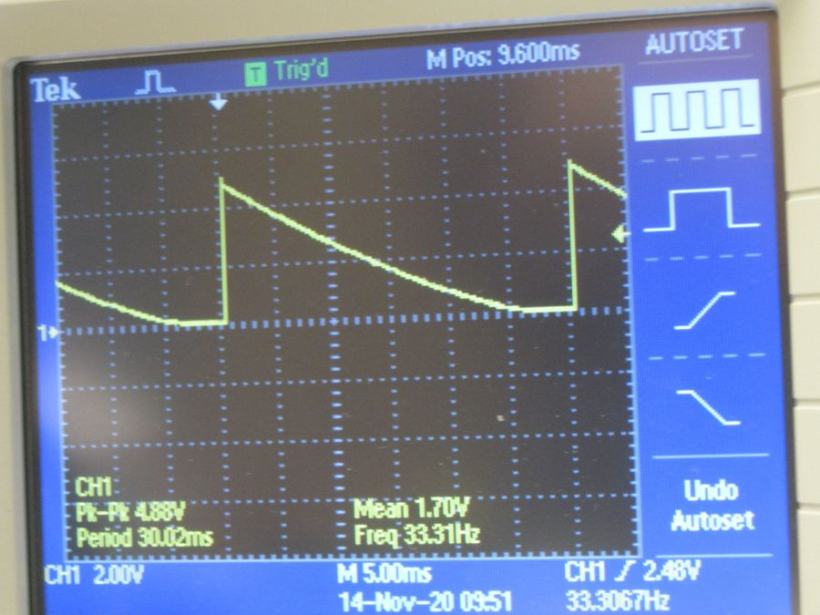
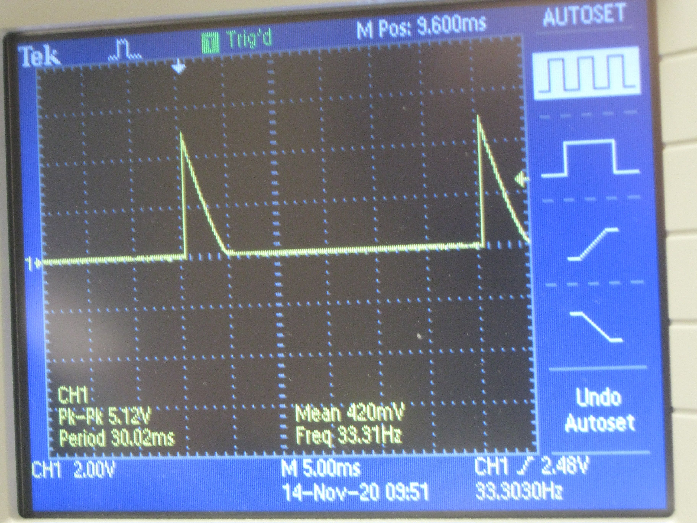
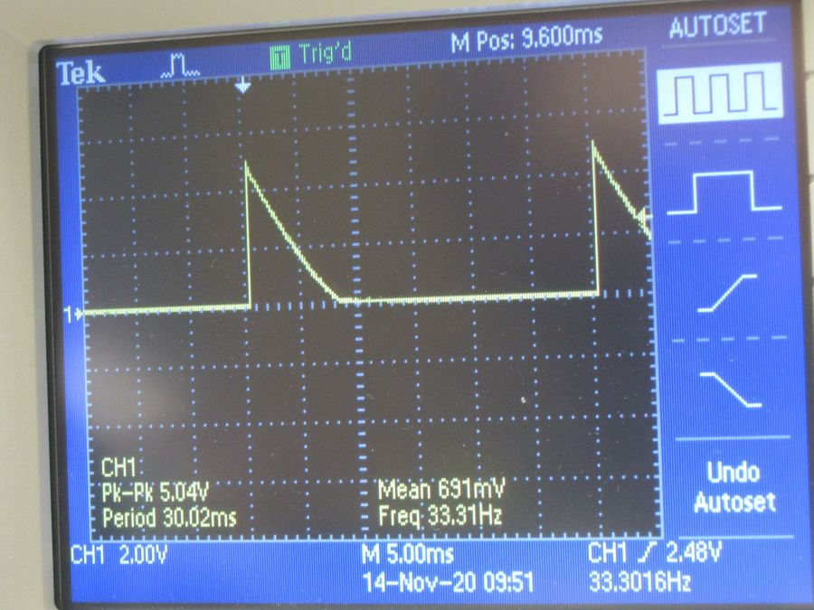
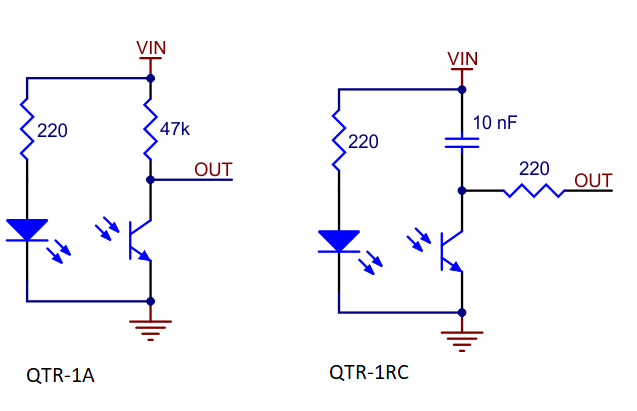
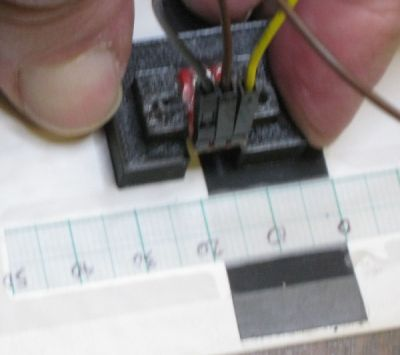

-   [Testing PIC18F46K42 XPRESS
    Board](#testing-pic18f46k42-xpress-board)
    -   [Pins Used](#pins-used)
    -   [Very Simple Test With Scope](#very-simple-test-with-scope)
        -   [Signal When the Sensor is Over Black
            Tape](#signal-when-the-sensor-is-over-black-tape)
        -   [Signal When the Sensor is Over White
            Paper](#signal-when-the-sensor-is-over-white-paper)
        -   [Signal When the Sensor is Over Edge of
            Tape](#signal-when-the-sensor-is-over-edge-of-tape)
    -   [Variants of Sensor Board](#variants-of-sensor-board)
        -   [Conversion to QTR-1RC](#conversion-to-qtr-1rc)
    -   [Working with PuTTY and
        limitations](#working-with-putty-and-limitations)
        -   [USB Frames](#usb-frames)
    -   [After Build Copy](#after-build-copy)
    -   [Tried Creating a Digraph of Part of this
        Repository](#tried-creating-a-digraph-of-part-of-this-repository)

<!---
use 
pandoc -s --toc -t html5 -c pandocbd.css README.pandoc.md -o index.html

pandoc -s --toc -t gfm README.pandoc.md -o README.md
-->

Testing PIC18F46K42 XPRESS Board
================================

This branch of the project was set up to test a reflective sensor
connected to the PIC18F46K42 XPRESS board.

There is another repository which deals with the 3D design of the
plastic support for the reflective sensor board.

-   <https://github.com/danpeirce/support-r-sensor>

Pins Used
---------

-   The reflective sensor is connected to R\_SENSOR (RD1).
-   UART2 is connected to the XPRESS boards USB interface PIC.
    -   Communication between UART2 and the interface IC is at 9600
        baud.

Very Simple Test With Scope
---------------------------

For the first simple test I used a scope to look at the timing and
simple delays in the code. This is not the method I would use if using
the PIC to measure the timing.

    R_SENSOR_TRIS = 0; // make pin an output
    __delay_us(20);
    R_SENSOR_TRIS = 1; // change pin to an input
    __delay_ms(30);   // allow capacitor to charge

**Note**

-   One leg of the capacitor is tied to VDD so the voltage is
    high when capacitor is discharged
-   The phototransistor in the sensor acts as a nearly constant current
    sink which charges the capacitor. Since a capacitor follows dv/dt =
    1/C \* I the dv/dt is as constant as the current.

### Signal When the Sensor is Over Black Tape

### Signal When the Sensor is Over White Paper

### Signal When the Sensor is Over Edge of Tape

Variants of Sensor Board
------------------------

There are two variants of the QTR-1xx reflective sensor.

1.  QTR-1A is intended to be an analogue board. On left in image below.
2.  QTR-1RC is intended connected to a general purpose I/O pin. On right
    in image below.

### Conversion to QTR-1RC

I actually ordered the wrong part. For testing purposes I was able to
convert the QTR1A to be equivalent to the QTR-1RC by removing the 47 KΩ
resistor and adding a 10 nF capacitor and 200 Ω resistor on the
breadboard.

Working with PuTTY and limitations
----------------------------------

One can use a PuTTY terminal with the virtual serial port of the Xpress
board. This works fine when one is typing into the terminal. There is an
issue though if one attempts pasting into the PuTTY terminal (using a
right mouse click). In that case only the first character is sent. This
is an issue of the USB to serial bridge on the Xpress board and not the
PIC code!

Others have commented on the limitation of the USART to USB bridge on
the Xpress board:

-   [Xpress PIC18F46K42 board virtual COM port bridge to UART receive
    limitations](https://www.microchip.com/forums/m1097510.aspx)

### USB Frames

I got interested in looking at the USB frames. In this branch I was
using delays. If one were using a typical FTDI USB to serial bridge the
characters could arrive at the PIC UART Rx pin at the full rate of the
serial interface. The bridge on the Xpress board limits the rate.

see <https://microchipdeveloper.com/usb:frames>

The following table was extracted from that page.

**Note**

-   The Xpress board uses USB 2 full speed.
-   Virtual COM ports enumerate as CDC class USB devices
-   CDC class USB devices use bulk transfers for data

**FULL SPEED** Frame size: 1 ms  

<table style="width:97%;">
<colgroup>
<col style="width: 24%" />
<col style="width: 24%" />
<col style="width: 24%" />
<col style="width: 24%" />
</colgroup>
<tbody>
<tr class="odd">
<td style="text-align: left;"><strong>Supported 
Transfer 
Types</strong></td>
<td style="text-align: left;"><strong>Maximum 
Size of 
Transfer</strong></td>
<td style="text-align: left;"><strong>Transfers 
per frame</strong></td>
<td style="text-align: left;"><strong>Maximum 
Theoretical 
Throughput</strong></td>
</tr>
<tr class="even">
<td style="text-align: left;">Control</td>
<td style="text-align: left;">64 bytes</td>
<td style="text-align: left;">1</td>
<td style="text-align: left;">64 kbytes/s</td>
</tr>
<tr class="odd">
<td style="text-align: left;">Interrupt</td>
<td style="text-align: left;">64 bytes</td>
<td style="text-align: left;">1</td>
<td style="text-align: left;">64 kbytes/s</td>
</tr>
<tr class="even">
<td style="text-align: left;">Bulk</td>
<td style="text-align: left;">64 bytes</td>
<td style="text-align: left;">Up to 19</td>
<td style="text-align: left;">1.2 Mbytes/s</td>
</tr>
<tr class="odd">
<td style="text-align: left;">Isochronous</td>
<td style="text-align: left;">1023 bytes</td>
<td style="text-align: left;">1</td>
<td style="text-align: left;">1023 kbytes/s</td>
</tr>
</tbody>
</table>

After Build Copy
----------------

Added after build execute option.

Note the path varies depending on where the project is located.

    copy C:\Users\danp\MPLABXProjects\xpress-pic18f46k42\dist\default\production\xpress-pic18f46k42.production.hex E:\output.hex /y

-   the output path will depend on the computer and operating system

Tried Creating a Digraph of Part of this Repository
---------------------------------------------------

