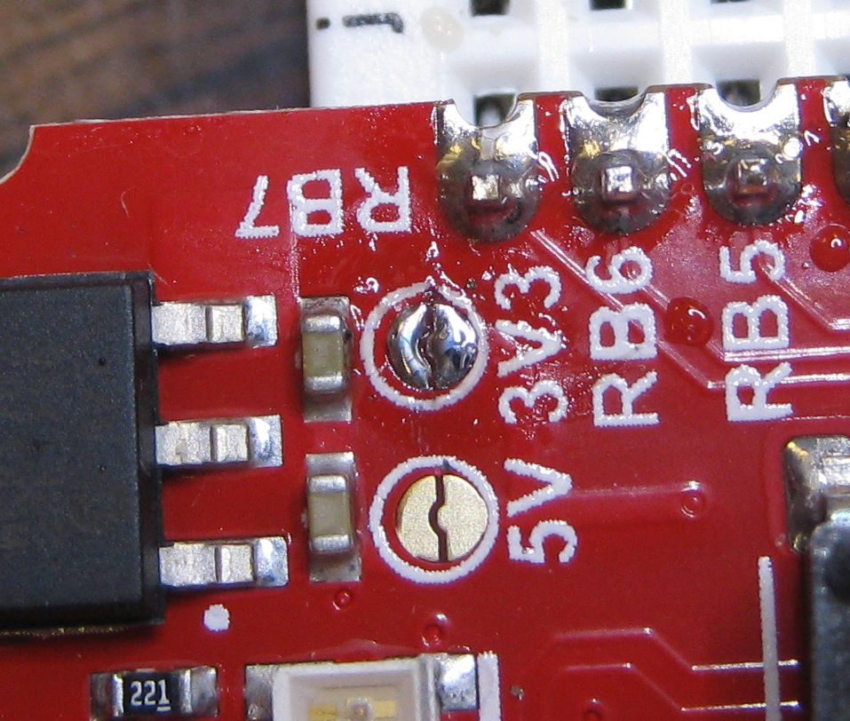
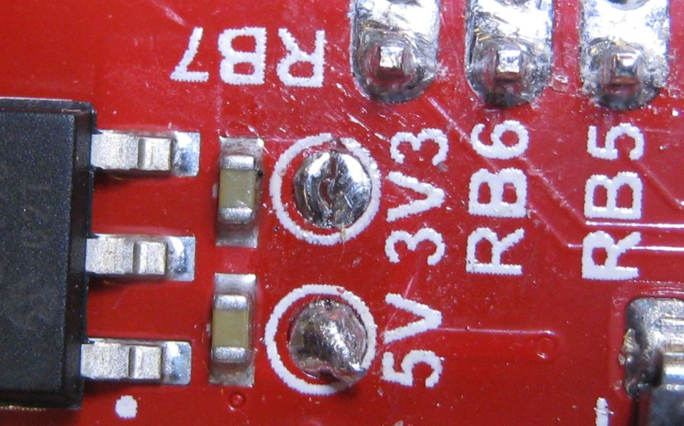

-   [Testing PIC18F46K42 XPRESS Board
    DAC](#testing-pic18f46k42-xpress-board-dac)
    -   [Used Fixed Voltage Reference](#used-fixed-voltage-reference)
    -   [Without a Buffer IC](#without-a-buffer-ic)
        -   [No Load](#no-load)
        -   [10 K Load](#k-load)
    -   [With IC Buffer and 400 ohm
        Load](#with-ic-buffer-and-400-ohm-load)
    -   [Pins Used](#pins-used)
        -   [Solder Bumps](#solder-bumps)
    -   [Connecting UART1 Tx to USB to Serial Adaptor to Test
        Board](#connecting-uart1-tx-to-usb-to-serial-adaptor-to-test-board)
    -   [Working with PuTTY and
        limitations](#working-with-putty-and-limitations)
    -   [After Build Copy](#after-build-copy)

<!---
use 
pandoc -s --toc -t html5 -c pandocbd.css README.pandoc.md -o index.html

pandoc -s --toc -t gfm README.pandoc.md -o README.md
-->

Testing PIC18F46K42 XPRESS Board DAC
====================================

This branch of the project was set up to look at the output of the DAC.
The PIC18F46K42 has just one internal 5 bit DAC. It is possible to
assign the DAC output to RA2 and/or RB7. When using the Xpress board it
is only practical to use RA2 as the DAC output pin because RB7 is
hardwired to the output of another IC on the board through a 220 Ω
resistor.

Used Fixed Voltage Reference
----------------------------

The internal fixed voltage reference was used with gain set to 4. This
results in a reference voltage of four volts. With is the DAC output
ranges from 0 to four volts.

Without a Buffer IC
-------------------

There is no built in buffer for the DAC in the PIC18F46K42. Even a 10 kΩ
load resistor has a drastic effect on the output voltage. This means it
is necessary to use an external buffer for the DAC.

### No Load

### 10 K Load

With IC Buffer and 400 ohm Load
-------------------------------

Pins Used
---------

-   DAC1OUT1 is on pin 4 (RC2)
-   UART1 is at 115200 baud. Tx1 is on RC6.
-   UART2 is connected to the XPRESS boards USB interface PIC.
    -   Communication between UART2 and the interface IC is at 9600
        baud.

### Solder Bumps

Solder Bump for 3.3 volts removed.

Solder Bump for 5 volts added.

Connecting UART1 Tx to USB to Serial Adaptor to Test Board
----------------------------------------------------------

Working with PuTTY and limitations
----------------------------------

One can use a PuTTY terminal with the virtual serial port of the Xpress
board. This works fine when one is typing into the terminal. There is an
issue though if one attempts pasting into the PuTTY terminal (using a
right mouse click). In that case only the first character is sent. This
is an issue of the USB to serial bridge on the Xpress board and not the
PIC code! This was verified by using a USB to serial bridge on a
different board (TTLyFTDI USB-to-TTL Cable Adapter) fed into RB7. In
this case the code worked as expected and all pasted characters appeared
in the PuTTY terminal and were correctly sent out uart1 TX.

Others have commented on the limitation of the USART to USB bridge on
the Xpress board:

-   [Xpress PIC18F46K42 board virtual COM port bridge to UART receive
    limitations](https://www.microchip.com/forums/m1097510.aspx)

After Build Copy
----------------

Added after build execute option.

    copy C:\Users\danp\MPLABXProjects\xpress-pic18f46k42\dist\default\production\xpress-pic18f46k42.production.hex E:\output.hex /y

-   the output path will depend on the computer and operating system

