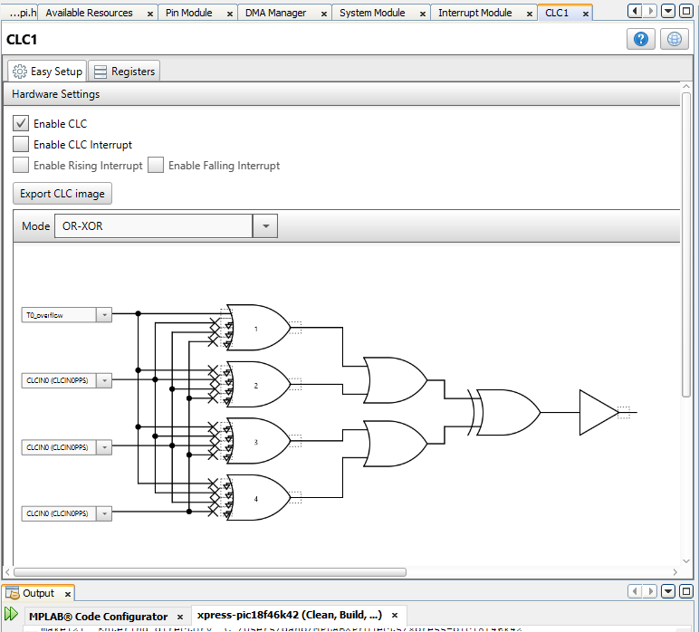

  - [Expansion of Pololu 3Pi Robot with Xpress
    board](#expansion-of-pololu-3pi-robot-with-xpress-board)
      - [Xpress Board Features](#xpress-board-features)
          - [Pins Used](#pins-used)
          - [Sensor Timing Measurements](#sensor-timing-measurements)
          - [Timer Setup](#timer-setup)
          - [Memory Needed to Store Data and
            Resolution](#memory-needed-to-store-data-and-resolution)
      - [Pololu 3Pi robot](#pololu-3pi-robot)
      - [Mounting PIC XPRESS board on 3Pi Expansion
        board](#mounting-pic-xpress-board-on-3pi-expansion-board)
          - [Mount 1 (historical)](#mount-1-historical)
          - [Mount 2](#mount-2)
      - [Roam and No Roam Slide Switch](#roam-and-no-roam-slide-switch)
      - [Autocalibrates when in Roam
        mode](#autocalibrates-when-in-roam-mode)
      - [Read Sensors](#read-sensors)
      - [Proportional Derivative Control in Roam
        mode](#proportional-derivative-control-in-roam-mode)
      - [Pull up on RX2/RB7](#pull-up-on-rx2rb7)
      - [Charging Circuit](#charging-circuit)
      - [Added Print Sensor Values to
        menu](#added-print-sensor-values-to-menu)
      - [Code Configurator settings](#code-configurator-settings)
      - [Working with PuTTY and issues](#working-with-putty-and-issues)
      - [Test of Expansion Board](#test-of-expansion-board)

<!---
use 
skip  pandoc -s --toc -t html5 -c pandocbd.css README.pandoc.md -o index.html
pandoc -s --toc -t gfm README.pandoc.md -o README.md
-->

# Expansion of Pololu 3Pi Robot with Xpress board

## Xpress Board Features

This board has a USB microB connector. It has a PIC MCU on board
configured to act as an interface and it enumerates as a multifunction
device. This allows one to both download programs to it and use the
interface as a virtual com port. The board is also less expensive than
the USB to serial board we have used in the past with the Microstick II
or PIC18F4525.

### Pins Used

  - UART1 is at 115200 baud. Tx1 is on RC6.
  - UART2 is connected to the XPRESS boards USB interface PIC.
      - Communication between UART2 and the interface IC is at 9600
        baud.
  - roam input used to determine if robot should
    1.  Stay in place (perhaps for programming)
    2.  Roam (perhaps following a line)
  - CLC1 output is the same as the T0\_overflow. The signal was made an
    output so that it can be mesured on a scope or with a DMM. In this
    case the CLC does not change the signal but simply makes it
    available on a PIN.

### Sensor Timing Measurements

  - On initiating a command to read sensors it consistently takes about
    100 µs for the sensors emitting diode to be turned on. Note that at
    115200 pbs one byte takes 10/115200 = 86.8 µs.
  - The phototransister signal does not start to change until after the
    first 320 µs. I am guessing they are giving the emitter diode time
    to stabilize. 320 - 100 = 220 µs to stabilize.
  - The total time the emitter diode is on appears to be 1 ms.
  - The time between when the emitter turns off until all the data is
    received is 1.26 ms. Note that sending 10 bytes of data takes 868
    µs. I’m guessing the 3Pi MCU needs to spend some time calculating
    the normalized values.
  - It takes about 2.42 ms per sample of five sensor values.
  - All five sensors are used in phase. The values are obtained from the
    same start point (not sequentially).

I am including two images of the DSO.

  - The first image is triggered from CH2 (white).
      - The positive going edge of CH2 indicates the PIC is about to
        start the write operation to UART1.
      - The signal on CH1 (yellow) is the signal from the sensor. There
        is a white reflective surface in this case.
  - The second image is also triggered from CH2 (white).
      - CH2 is the same and remains the phase reference.
      - CH1 (yellow) now shows the signal on the emitting IR diode. All
        the emitting IR diodes are in series. When the signal is high
        the IR is off. When the signal is low the IR is on. The IR is
        only on during the time used to acquire the sensor readings. It
        is off when the 3Pi MCU is processing and sending data.

### Timer Setup

#### TMR0

The TMR0\_Overflow Rate varies a bit from robot to robot but is about
2.0 KHz

#### TMR1

### Memory Needed to Store Data and Resolution

The PIC18F46K42 has 4 KB of on chip RAM which is more than enough until
we want to use it to store data. The data from the sensors can be useful
when analyzing what the robot can see as it moves. To obtain the data it
first needs to be stored because it is not really practical to have the
robot dragging a USB cable along when it is moving and we don’t have a
wireless communication channel.

I chose to save **1000 samples** for **each of three sensors**. There
are actually five sensors on the robot but I will only save data from
three on a given run to keep the memory requirements within what is
needed.

The normalized sensor values range from 0 to 1000. It would take 10 bits
at least to store each sample at full resolution. It was decided to
reduce the resolution of the samples so that the values could be stored
in 8 bytes as the physical memory is organized into 8 bit bytes. **A
right shift of two places is used to reduce the resolution before
storing the sensor values in arrays.** Later when the robot is connected
to a computer each sample read from the array will be sifted two places
to the left so the magnitude will be restored to the original value
(less the lost resolution).

## Pololu 3Pi robot

The robot is running the serial slave program from Pololu. This will
allow the 3Pi robot to be controlled from a XPRESS board.

  - [10.a. Serial slave
    program](https://www.pololu.com/docs/0J21/all#10.a)

More information on the Pololu 3Pi robot

  - <https://www.pololu.com/product/975>

## Mounting PIC XPRESS board on 3Pi Expansion board

### Mount 1 (historical)

The first XPRESS board mount was forward on the 3Pi expansion board.
This appeared to have a negative effect on the balance and stability of
the robot. For a second mount position was tested.

### Mount 2

For better stability the XPRESS board was moved over the wheels.

Wiring under the XPRESS board.

## Roam and No Roam Slide Switch

The image below shows the slide switch in the no roam possition.

## Autocalibrates when in Roam mode

Will autocalibrate the sensors if in Roam mode. For meaningful results
the robot should be sitting over a black tape line. The robot will spin
to the left and right sweeping the sensors over the line so that
normalized readings can be calculated.

## Read Sensors

Code was added to read the sensors while the **slave** is executing
proportional derivative control.

  - see **Proportional Derivative Control in Roam mode** section down
    below.

Unlike the **test-read-sensors** branch the sensor values are not sent
to PuTTY.

Currently in the main branch far left and far right sensor are checked
to see if they are greater than 500. If either are greater than 500 it
is assumed a line was seen on the far left or far right and this causes
the robot to exit proportional derivative control. It just stops and
does nothing in that case.

Note that this is simply a test to ensure that the slave can
successfully both run proportional derivative control and report sensor
readings back to the PIC on the Xpress board.

In this branch the test2\_PORT signals are ignored\! The following was
used only in the **test-read-sensors** branch:

**test2\_PORT** was used to provide timing to a DSO so that the time
required to read all 5 sensors and load that data into the PIC18F46K42
could be measured. The time was **2.46 mS**.

The test points are shown in this image:

The timing signal from test2\_PORT on the Digital Storage Oscilloscope:

## Proportional Derivative Control in Roam mode

Another function has been added to allow the MCU on the main board of
the 3Pi robot to run proportional derivative code when the robot is in
Roam mode. The robot follows sharp turns and curves but knows nothing of
gaps and other APSC1299 special obstacles. This could possibly work fine
for demos.

## Pull up on RX2/RB7

A 10 Kohm pull up resistor was added to RX2 for better reliability when
USB cable is not attached.

## Charging Circuit

A charging circuit has been added to the expantion board. The charging
circuit is just a 75 ohm resistor in series with the four AAA NiMH cells
on the robot. A 9 volt external AC-DC adaptor provides power to the
board.

Showing the 75 ohm 2 watt resistor (located under the expansion board.

**Will update photos. Had to move one jumper to top side of board as it
caused rubbing on right wheel. Also bend tab on barrel connector so it
is flush on board before soldering.**

## Added Print Sensor Values to menu

Can now print sensor values in PuTTY when in No Roam mode. Can move
robot over track by hand.

## Code Configurator settings

The code in this project was primarily generated by the Code
Configurator. The settings used may not be optimal at all. The initial
goal was just to get the UART of the target PIC to talk to the UART of
the interface PIC.

## Working with PuTTY and issues

One can use a PuTTY terminal with the virtual serial port of the Xpress
board. This works fine when one is typing into the terminal. There is an
issue though if one attempts pasting into the PuTTY terminal (using a
right mouse click). In that case only the first character is sent. This
is an issue of the USB to serial bridge on the Xpress board and not the
PIC code\!

Others have commented on the limitation of the USART to USB bridge on
the Xpress board:

  - [Xpress PIC18F46K42 board virtual COM port bridge to UART receive
    limitations](https://www.microchip.com/forums/m1097510.aspx)

## Test of Expansion Board

Initial testing of expansion board for 3PI.

