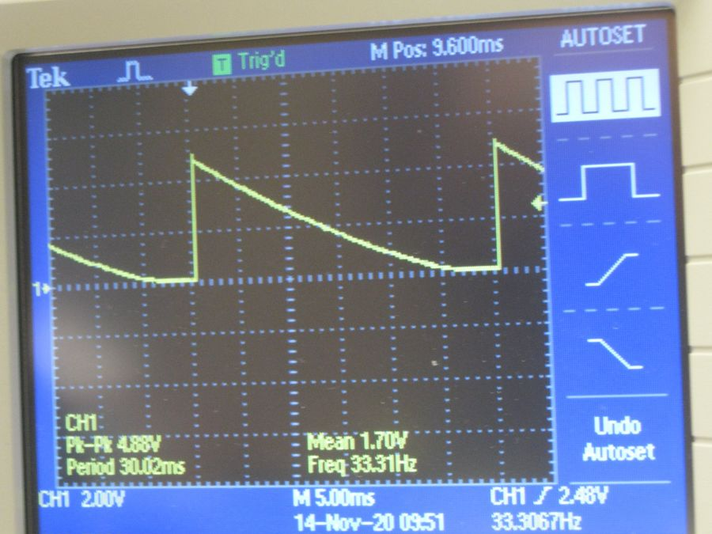
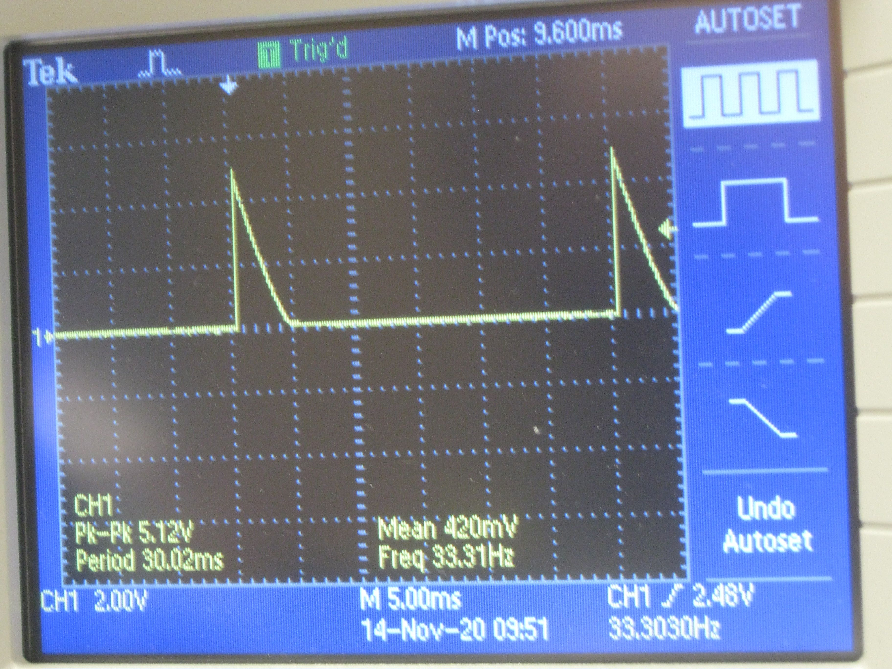
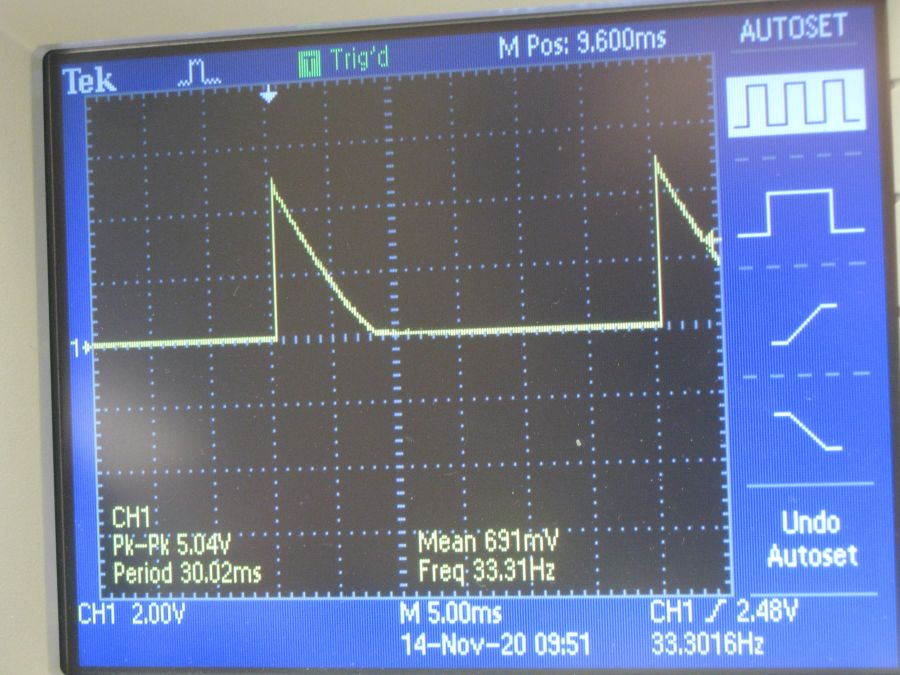
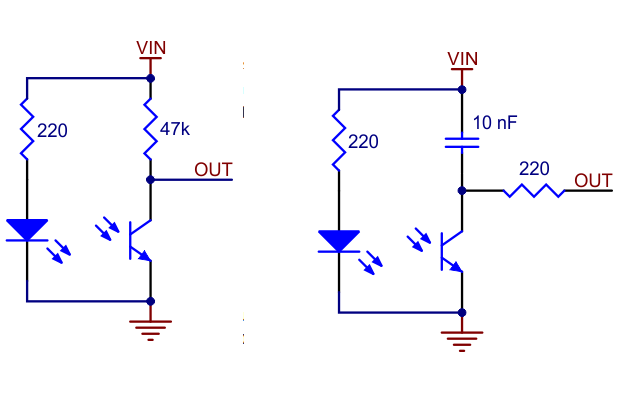
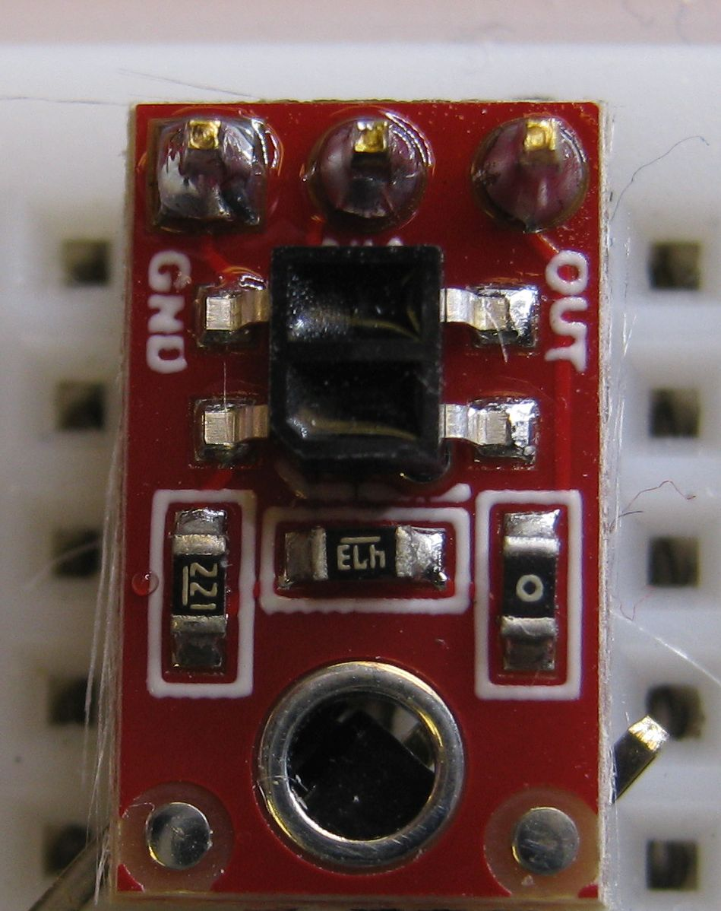
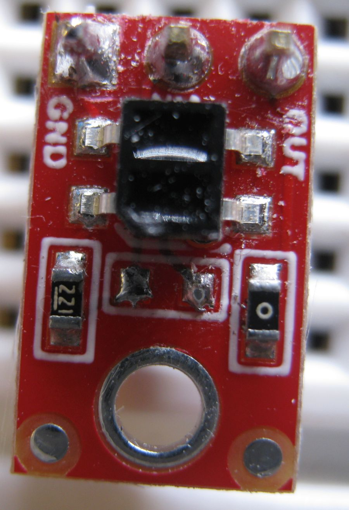
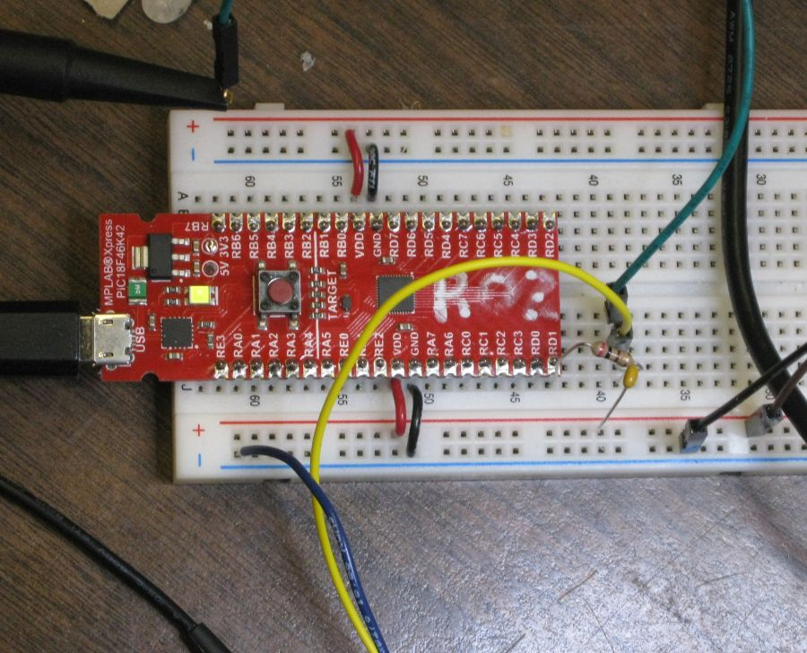
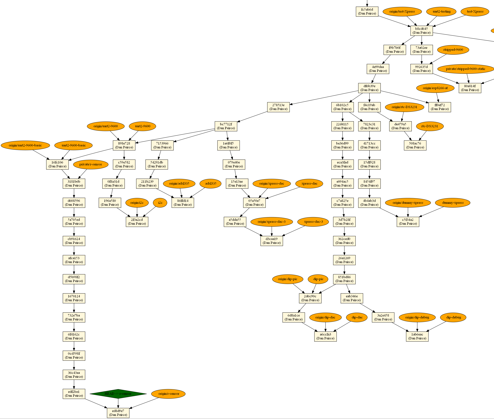

% Testing PIC18F46K42 XPRESS Board
% by Dan Peirce B.Sc.

<!---
use 
pandoc -s --toc -t html5 -c pandocbd.css README.pandoc.md -o index.html

pandoc -s --toc -t gfm README.pandoc.md -o README.md
-->

# Testing PIC18F46K42 XPRESS Board

This branch of the project was set up to test a reflective sensor connected to the PIC18F46K42 XPRESS board.

There is another repository which deals with the 3D design of the plastic support for the reflective sensor board.

* [https://github.com/danpeirce/support-r-sensor](https://github.com/danpeirce/support-r-sensor)

 
## Pins Used

* The reflective sensor is connected to R_SENSOR (RD1).
* UART2 is connected to the XPRESS boards USB interface PIC. 
    * Communication between UART2 and the interface IC is at 9600 baud.

## Very Simple Test With Scope

For the first simple test I used a scope to look at the timing and simple delays in the code. This is not the 
method I would use if using the PIC to measure the timing.

~~~~c
R_SENSOR_TRIS = 0; // make pin an output
__delay_us(20);
R_SENSOR_TRIS = 1; // change pin to an input
__delay_ms(30);   // allow capacitor to charge
~~~~

**Note**

* One leg of the capacitor is tied to VDD so the voltage is high when capacitor is discharged
* The phototransistor in the sensor acts as a nearly constant current sink which charges the capacitor. Since a capacitor 
  follows dv/dt = 1/C * I the dv/dt is as constant as the current.

### Signal When the Sensor is Over Black Tape

### Signal When the Sensor is Over White Paper

### Signal When the Sensor is Over Edge of Tape

## Variants of Sensor Board

There are two variants of the QTR-1xx reflective sensor.

1.  QTR-1A is intended to be an analogue board. On left in image below.
2.  QTR-1RC is intended connected to a general purpose I/O pin. On right in image below.

### Conversion to QTR-1RC

The QTR-1A was ordered. It was converted to be equivalent to the QTR-1RC by 
removing the 47 KΩ resistor and adding a 10 nF capacitor and 200 Ω resistor on the breadboard.

A close up of a QTR-1A is shown here.

The 47 KΩ resistor needs to be removed to in order to do the conversion.

A 0.01 µF (10 nF) capacitor and a 200 Ω resistor are added on the breadboard.

## Working with PuTTY and limitations

One can use a PuTTY terminal with the virtual serial port of the Xpress board. This works fine when one is typing into the 
terminal. There is an issue though if one attempts pasting into the PuTTY terminal (using a right mouse click). In that case
only the first character is sent. This is an issue of the USB to serial bridge on the Xpress board and not the PIC code!

Others have commented on the limitation of the USART to USB bridge on the Xpress board:

* [Xpress PIC18F46K42 board virtual COM port bridge to UART receive limitations](https://www.microchip.com/forums/m1097510.aspx)

### USB Frames

I got interested in looking at the USB frames.  In this branch I was using delays. If one were using a typical FTDI USB to serial bridge 
the characters could arrive at the PIC UART Rx pin at the full rate of the serial interface. The bridge on the Xpress board limits 
the rate.

see [https://microchipdeveloper.com/usb:frames](https://microchipdeveloper.com/usb:frames)

The following table was extracted from that page. 

**Note** 

* The Xpress board uses USB 2 full speed.
* Virtual COM ports enumerate as CDC class USB devices
* CDC class USB devices use bulk transfers for data

[**FULL SPEED**]{style="font-size:125%;"} [
]{style="white-space: pre-wrap;"}Frame size: 1 ms\

  ----------------- ----------------- ----------------- -----------------
  **Supported\      **Maximum\        **Transfers\      **Maximum\
  Transfer\         Size of\          per frame**       Theoretical\
  Types**           Transfer**                          Throughput**

  Control           64 bytes          1                 64 kbytes/s

  Interrupt         64 bytes          1                 64 kbytes/s

  Bulk              64 bytes          Up to 19          1.2 Mbytes/s

  Isochronous       1023 bytes        1                 1023 kbytes/s
  ----------------- ----------------- ----------------- -----------------

## After Build Copy

Added after build execute option.

Note the path varies depending on where the project is located.

~~~~
copy C:\Users\danp\MPLABXProjects\xpress-pic18f46k42\dist\default\production\xpress-pic18f46k42.production.hex E:\output.hex /y
~~~~

* the output path will depend on the computer and operating system

## Tried Creating a Digraph of Part of this Repository

