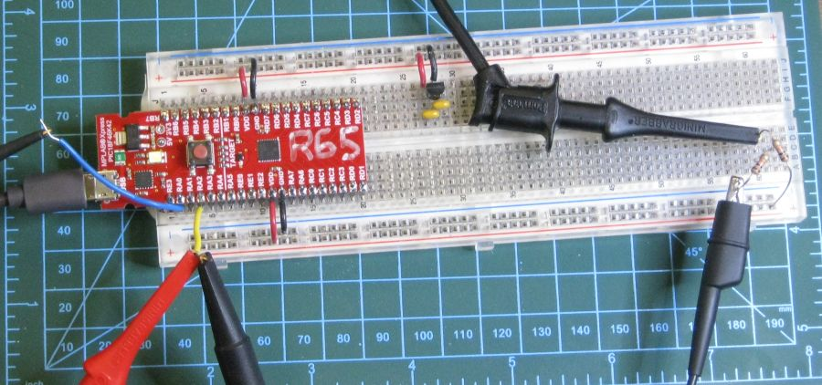
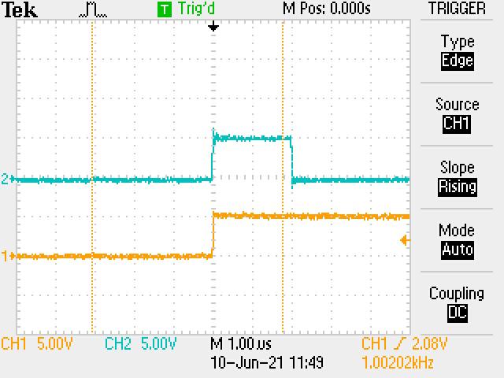
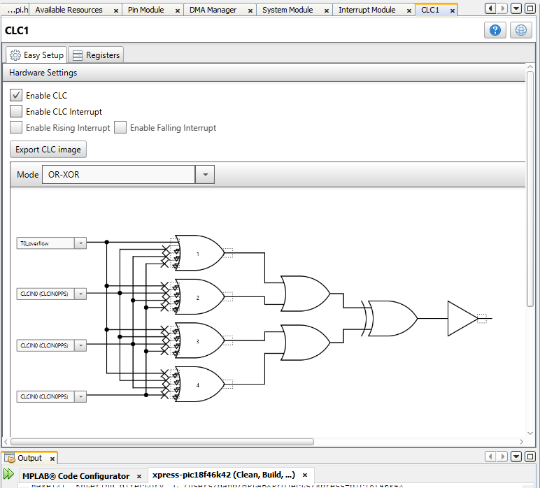
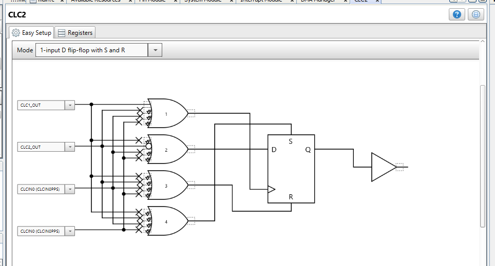
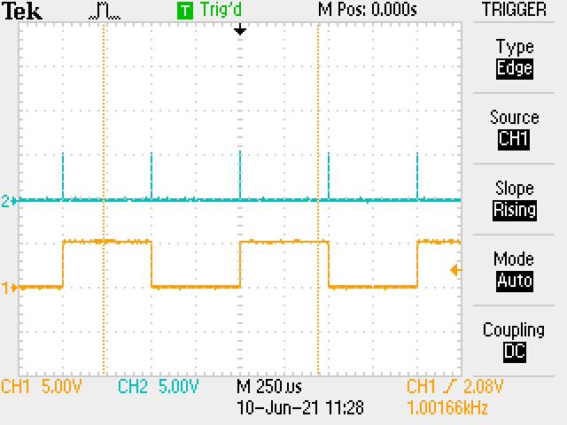
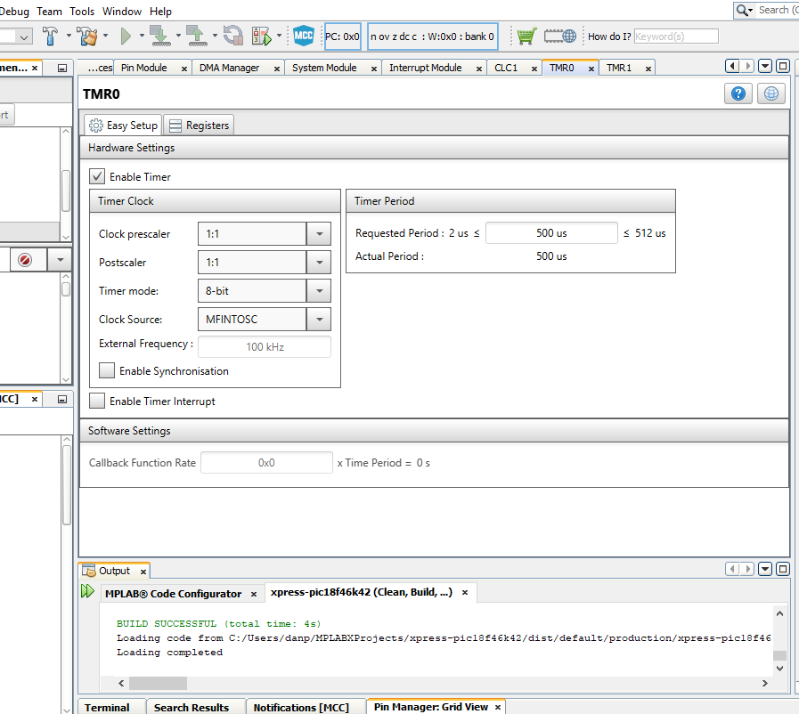
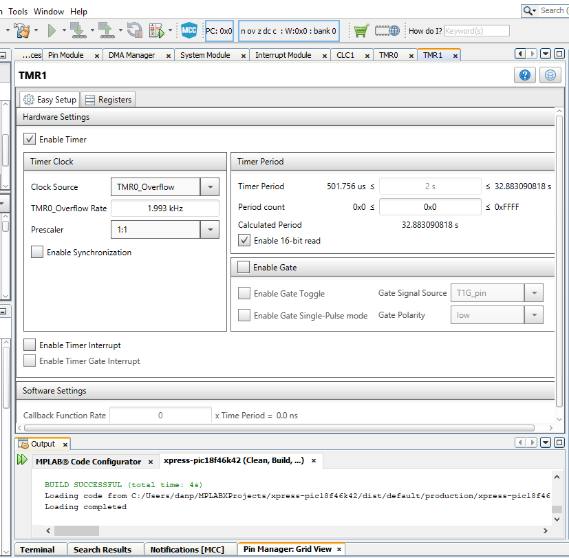

% Using CLC for Clock Outputs

<!---
use 
skip  pandoc -s --toc -t html5 -c pandocbd.css README.pandoc.md -o index.html
pandoc -s --toc -t gfm README.pandoc.md -o README.md
-->

# Using CLC for Clock Outputs

## Xpress Board Features

This board has a USB microB connector. It has a PIC MCU on board configured to act as an interface and it enumerates as 
a multifunction device. This allows one to both download programs to it and use the interface as a virtual com port. The board
is also less expensive than the USB to serial board we have used in the past with the Microstick II or PIC18F4525.

### Pins Used

* UART1 is at 115200 baud. Tx1 is on RC6.
* UART2 is connected to the XPRESS boards USB interface PIC. 
    * Communication between UART2 and the interface IC is at 9600 baud.
* 
* CLC1 output is the same as the T0_overflow. The signal was made an output so that it can be measured on a scope or with a DMM.
  In this case the CLC does not change the signal but simply makes it available on a PIN. I had this set up for my 3Pi Robot code and 
  have reused that setup here.
  
  
  

### CLC-2 Divide by Two

The output of CLC-1 (see note in Pins Used section) is at 2 KHz with a very low duty cycle (2 µs pulse repeating every 500 ms). The 2 µs pulse is too 
short to be picked up by the MS8217 DMM. CLC-2 divides the frequency by 2 and 
the output is 50.0% duty cycle. No code is used to provide this divide by two. CLC-2 configured as a D flip flop with the output inverted and then fed 
back into the D input.

The CLC-2 output is the yellow trace on the following image of the scope. 

### Timer Setup

#### TMR0

The TMR0_Overflow Rate varies a bit but is about 2.0 KHz.

#### TMR1

## Working with PuTTY and issues

One can use a PuTTY terminal with the virtual serial port of the Xpress board. This works fine when one is typing into the 
terminal. There is an issue though if one attempts pasting into the PuTTY terminal (using a right mouse click). In that case
only the first character is sent. This is an issue of the USB to serial bridge on the Xpress board and not the PIC code!

Others have commented on the limitation of the USART to USB bridge on the Xpress board:

* [Xpress PIC18F46K42 board virtual COM port bridge to UART receive limitations](https://www.microchip.com/forums/m1097510.aspx)

