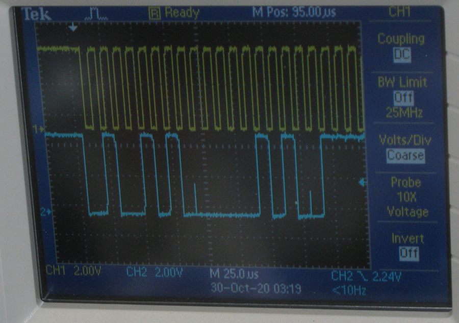
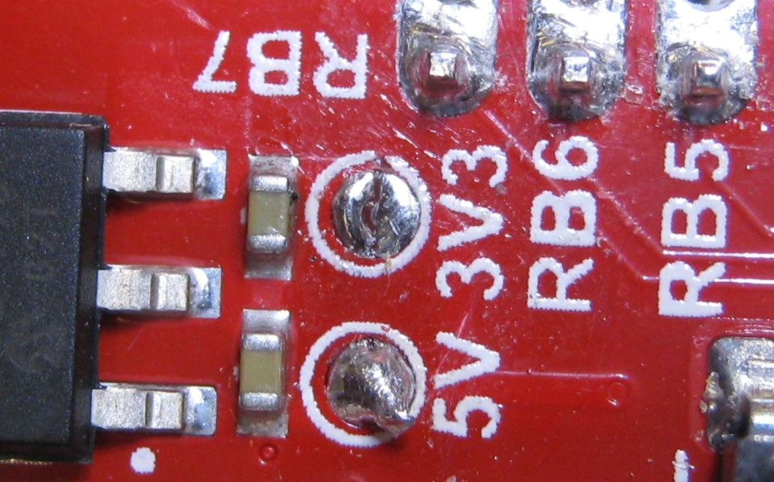

% Testing PIC18F46K42 XPRESS Board
% by Dan Peirce B.Sc.

<!---
use 
pandoc -s --toc -t html5 -c pandocbd.css README.pandoc.md -o index.html

pandoc -s --toc -t gfm README.pandoc.md -o README.md
-->

# Testing PIC18F46K42 XPRESS Board

This branch of the project was set up to test the Grove 16x2 LCD display.

## I2C Signals

Channel 1 shows SCL1 and channel 2 shows SDA1.
Note that 

* data bits are latched in on the rising edge of SDA1. 
* The pattern is seen here is the second one that triggered the scope
  The first one told the device to make all the I/O outputs.
  This one told the device to set all the outputs high.
    * device address 0100 1010 followed by 
	* an ACK 0 followed by 
	* a register address 0000 1010 followed by
	* The pattern of highs and lows 1111 1111 (runs off edge of scope image)
* the device address seen here is 0100 1010 or 0x4A but the software constructs that from 
    * the 7 bit address 0100101 plus 0 for write.
	* in the firmware main.c the value 00100101 is used or 0x25 which is the same as 
	  0x4A divided by two. If a read instruction is used it would be divided by 2 and a 1 added.
	  
 

## Xpress Board Pins Used

* UART1 is at 115200 baud. Tx1 is on RC6.
* UART2 is connected to the XPRESS boards USB interface PIC. 
    * Communication between UART2 and the interface IC is at 9600 baud.

### Solder Bumps

Solder Bump for 3.3 volts removed.

Solder Bump for 5 volts added.

## LCD notes

* I2C Address 	0X3E from [Grove - 16x2 LCD Specification](https://wiki.seeedstudio.com/Grove-16x2_LCD_Series/#specification)

## Working with PuTTY and limitations

One can use a PuTTY terminal with the virtual serial port of the Xpress board. This works fine when one is typing into the 
terminal. There is an issue though if one attempts pasting into the PuTTY terminal (using a right mouse click). In that case
only the first character is sent. This is an issue of the USB to serial bridge on the Xpress board and not the PIC code!
This was verified by using a USB to serial bridge on a different board (TTLyFTDI USB-to-TTL Cable Adapter) fed into RB7. In this case the code worked as expected
and all pasted characters appeared in the PuTTY terminal and were correctly sent out uart1 TX.

Others have commented on the limitation of the USART to USB bridge on the Xpress board:

* [Xpress PIC18F46K42 board virtual COM port bridge to UART receive limitations](https://www.microchip.com/forums/m1097510.aspx)

## After Build Copy

Added after build execute option.

~~~~
copy C:\Users\danp\MPLABXProjects\xpress-pic18f46k42\dist\default\production\xpress-pic18f46k42.production.hex E:\output.hex /y
~~~~

* the output path will depend on the computer and operating system

