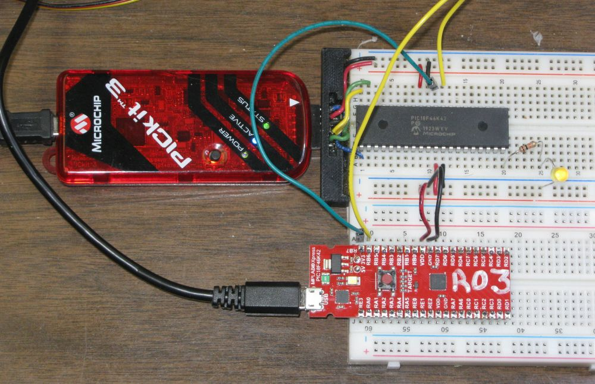
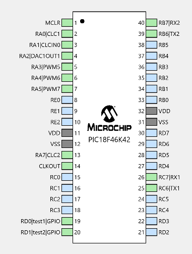
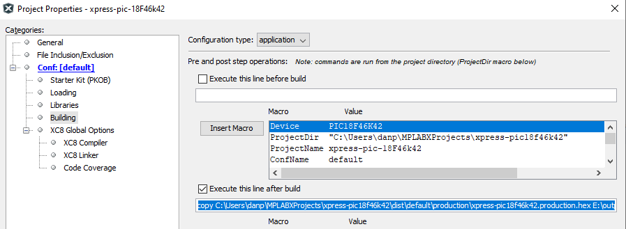

% Testing PIC18F46K42 XPRESS Board
% by Dan Peirce B.Sc.

<!---
use 
pandoc -s --toc -t html5 -c pandocbd.css README.pandoc.md -o index.html

pandoc -s --toc -t gfm README.pandoc.md -o README.md
-->

# Testing programs in the DIP PIC18F46K42 IC

This branch of the project was set up to test the feasibility of using a DIP version of the PIC18F46K42 as the target device
and connecting to the Xpress board as a USB to serial adaptor. The reasons for doing this:

* to allow a PICkit3 or PICkit4 to be used as a programmer/debugger. 
* to allow one to try features of the PIC18F46K42 that are incompatible with the Xpress board. The incompatibility arises if a feature 
	requires RC7 to be no-load. On the Xpress board the output from the UART to serial bridge is connected to RC7 through a 220 Ω resistor.

## Board Features

This board has a USB microB connector. It has a PIC MCU on board configured to act as an interface and it enumerates as 
a multifunction device. This allows one to both download programs to it as a mass storage device and use the interface as 
a virtual com port. 

### Pins Used

* UART1 is at 115200 baud. Tx1 is on RC6. (to be relocated away from RC7).
* UART2 is connected to the XPRESS boards USB interface PIC. 
    * Communication between UART2 and the interface IC is at 9600 baud.

### Solder Bumps

Solder Bump for 3.3 volts removed.

Solder Bump for 5 volts added.

## Working with PuTTY and limitations

One can use a PuTTY terminal with the virtual serial port of the Xpress board. This works fine when one is typing into the 
terminal. There is an issue though if one attempts pasting into the PuTTY terminal (using a right mouse click). In that case
only the first character is sent. This is an issue of the USB to serial bridge on the Xpress board and not the PIC code!
This was verified by using a USB to serial bridge on a different board (TTLyFTDI USB-to-TTL Cable Adapter) fed into RB7. In this case the code worked as expected
and all pasted characters appeared in the PuTTY terminal and were correctly sent out uart1 TX.

Others have commented on the limitation of the USART to USB bridge on the Xpress board:

* [Xpress PIC18F46K42 board virtual COM port bridge to UART receive limitations](https://www.microchip.com/forums/m1097510.aspx)

## After Build Copy

Added after build execute option.

~~~~
copy C:\Users\danp\MPLABXProjects\xpress-pic18f46k42\dist\default\production\xpress-pic18f46k42.production.hex E:\output.hex /y
~~~~

* the output path will depend on the computer and operating system

