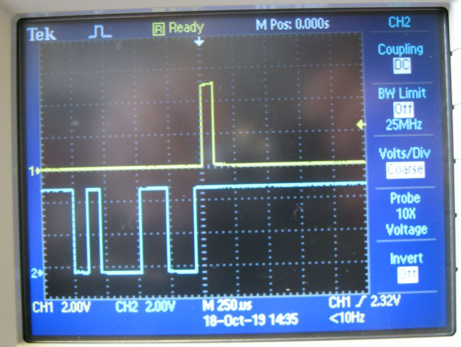
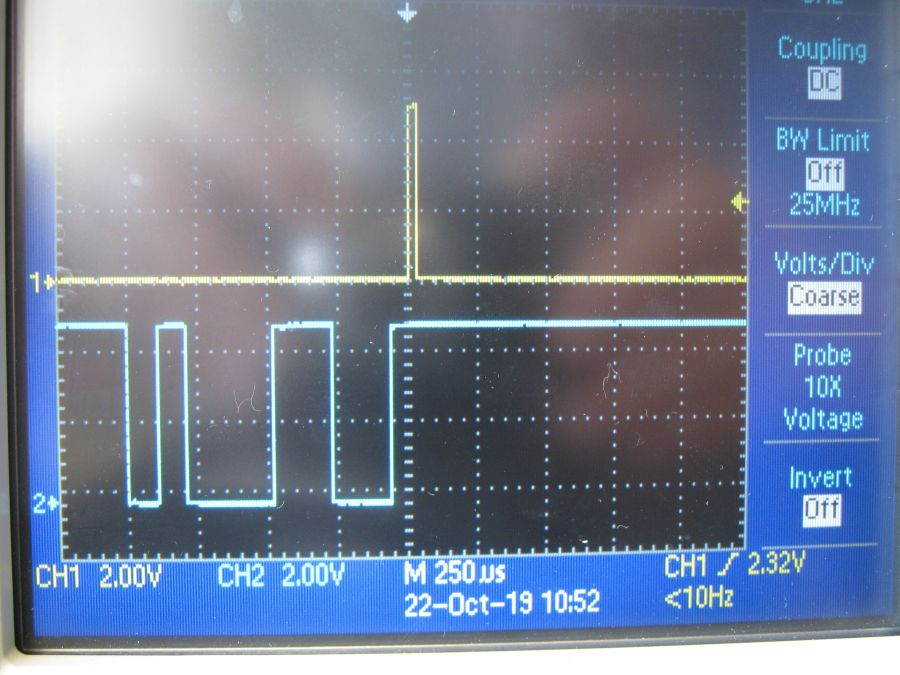
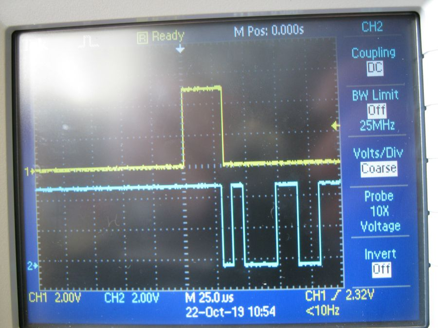
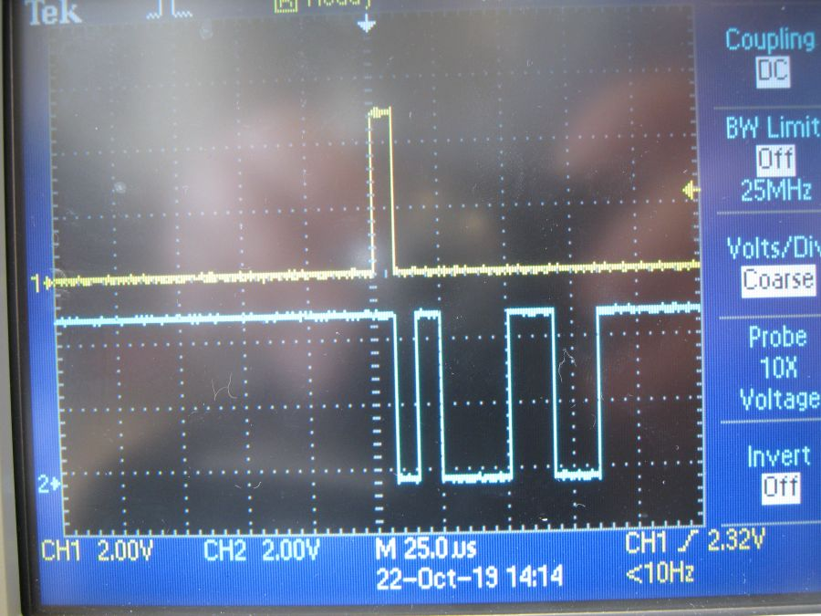
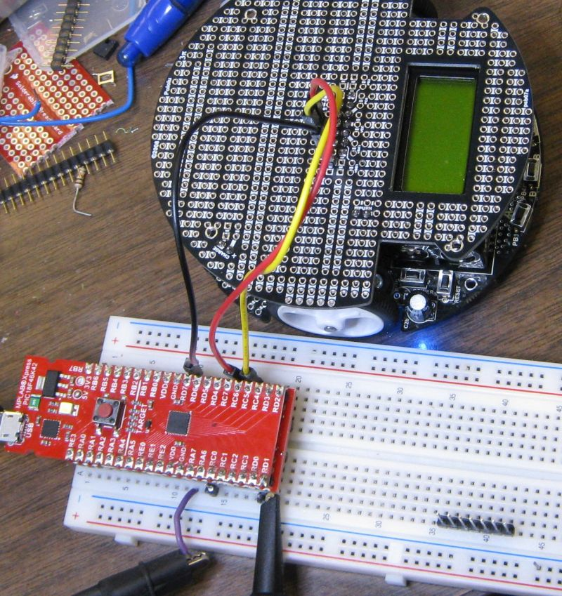
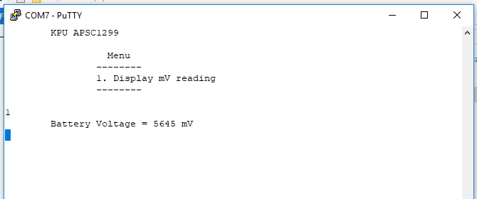

# Testing PIC18F46K42 XPRESS Board

The following was moved from the README.md file on April 5, 2020 as it is now essentially historical.

## Tags

* echo 
    * Anything received on the boards USB was echoed back
* echo.and.printf
    * As above but adds initial message using printf() 
	* the printf is directed to UART2 which is connected to the USB
* echo.copy.uart1
    * as above but everything echoed back to USB is also echoed to UART1 TX
	* This is a very simple change. Just starting to explore the use of two UARTs
* echo.copy.uart1.newline
    * as above but newline character added to carriage returns
	* new section below on PuTTY issues (limitations on USB to serial bridge of Xpress board)
* timingtest1
    * as above but added digital outputs for timing tests
    * Section added below with more detail
* clock48MHz
    * as above but changed internal clock to 48 MHz / 4
	* changed uart1 baud rate to 115200.
	* section added below with more detail
* clock48MHz.div1
    * fixed clock by dividing by 1 rather than 4.
* bat.voltage.test
    * Connected PIC18F46K42 to 3Pi expansion and tested read voltage command.
	* Section added below with more detail
* sig.3p
    * Added send Signature command
	* also created LCD_print() function
	* block below was coppied from a PuTTY session in which the Signature feature
	  was tested.
	  
~~~~
        KPU APSC1299

                  Menu
                --------
                @. Pololu Signature?
                1. Display mV reading
                2. Display mV reading in LCD
                c. Clear LCD
                -. Send hyphen to LCD
                ~. LCD message APSC1299
                ?. LCD display error and hex 3F
                ' '. LCD display error and hex 20
                --------

-
c
@
        The Signature from 3Pi is: 3pi1.1
c
~~~~

* LCDtype tag

    * Typing Characters not in menu will result in sending character to LCD
    * Enter key (return character) will move cursor to beginning of second line of display (character zero row one).
	
### timingtest1 tag

In this branch looked at timing in main while loop.

* channel 1 is test2_PORT
* channel 2 is test1_PORT

Used channel 1 as normal trigger source. Channel 1 stays high when character received on UART2 until it is ready for another character.

A text '1' was typed into the PuTTY terminal.
	
* channel 1 is test2_PORT  (RD1)
* channel 2 is RX on UART2 (RB7)
	

	
* Pins Used

### clock48MHz

A text '1' was typed into the PuTTY terminal.
	
* channel 1 is test2_PORT  (RD1)
* channel 2 is RX on UART2 (RB7)
	

UART1 is now at 115200 baud.

* channel 1 is test2_PORT  (RD1)
* channel 2 is TX on UART1 (RC6)
	

### clock48MHz.div1

UART1 is now at 115200 baud.

* channel 1 is test2_PORT  (RD1)
* channel 2 is TX on UART1 (RC6)
	

### bat.voltage.test tag

Used UART1 of PIC18F46K42 to communicate with the 3Pi robot. Used UART2 to communicate with PuTTY via USB.

## More info on the DM182026

* [https://www.microchip.com/DevelopmentTools/ProductDetails/DM182026](https://www.microchip.com/DevelopmentTools/ProductDetails/DM182026)

The documents on that site are helpful but what I did not find was simple examples specifically for this board before going
ahead and trying out the code configuator. The default program in the PIC18F46K42 appeared to set most the pins as GPIO and 
send a pulse to them periodically. The USART in the target MCU was not interacting at all with the MCU on the board providing 
the USB to serial functions. 

### Probing the DM182026 for Serial Signal

**This section is now historical only.**

* The serial signal from the USB multifunction MCU was verified as transmitting a serial signal by 
  testing with PuTTY on a computer and probing with a Digital Storage Oscilloscope.
* It was verified that the other side of a buffer resistor was connected to RB7 using an Ohm meter (the board was disconnected 
  from the USB for this test).
  

* The serial signal from PuTTY would be seen on RB7 of the target PIC if the pin were configured as an input. One would most 
  certainly want to configure RB6 as the PIC TX pin and RB7 as the PIC RX pin.